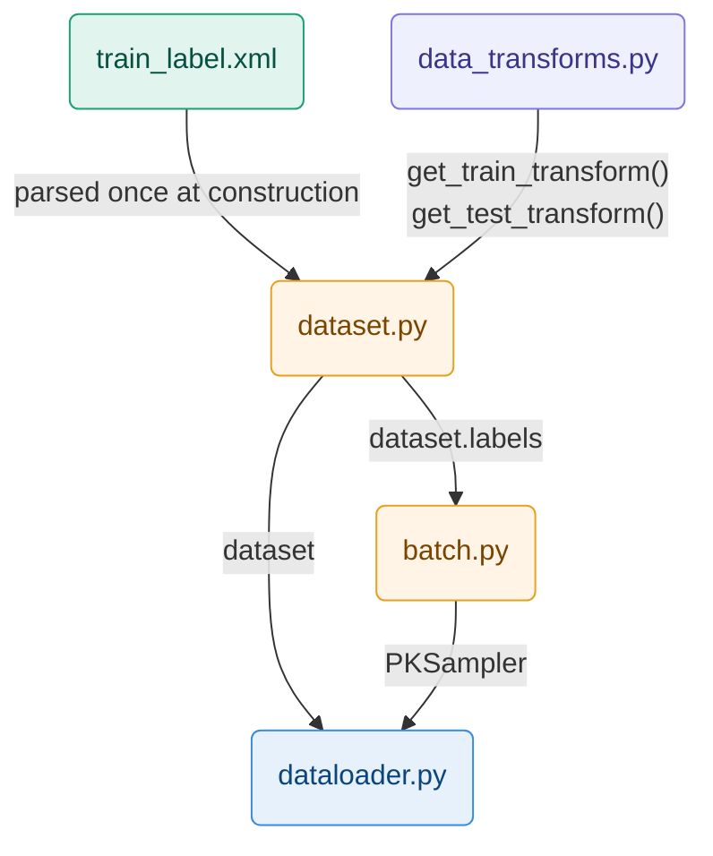

# Code Architecture

## Data Initialization



```
train_label.xml       ← source of labels (vehicleID, cameraID) for each image
      ↓
data_transforms.py    ← two transform pipelines passed to the Dataset constructor
                            train : crop · flip · jitter · blur · erase · normalize
      ↓                     test  : resize · normalize — deterministic, required for kNN

dataset.py            ← reads XML, loads images on the fly, returns (tensor, vid, cid)
                         self.samples[i] = (img_path, vehicle_id, camera_id)
      ↓                  self.labels[i]  = vehicle_id — only attribute consumed by PKSampler

batch.py              ← receives dataset.labels, groups indices by vehicle_id
                         samples P=16 identities × K=4 images per batch
      ↓                  guarantees 3 positives and 60 negatives per anchor for the triplet loss

dataloader.py         ← wraps dataset + PKSampler into a PyTorch DataLoader
                            train : drop_last=True  — incomplete batch breaks the triplet loss
                            query/test : shuffle=False — fixed order required for kNN
```

## Model Construction

## Train and Evaluate Process

## Test and Monitoring

### Losses

### Gradients
