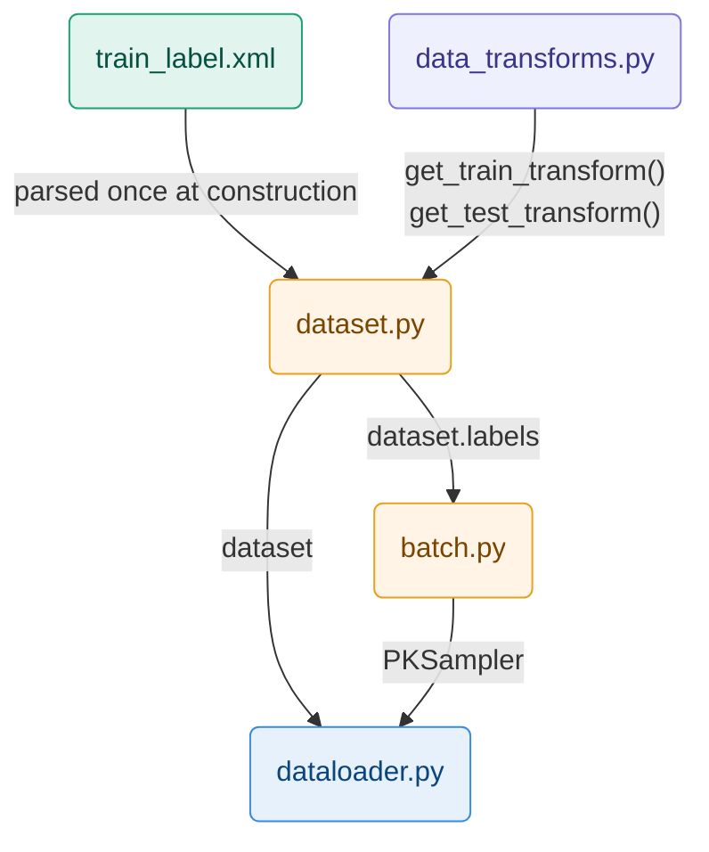
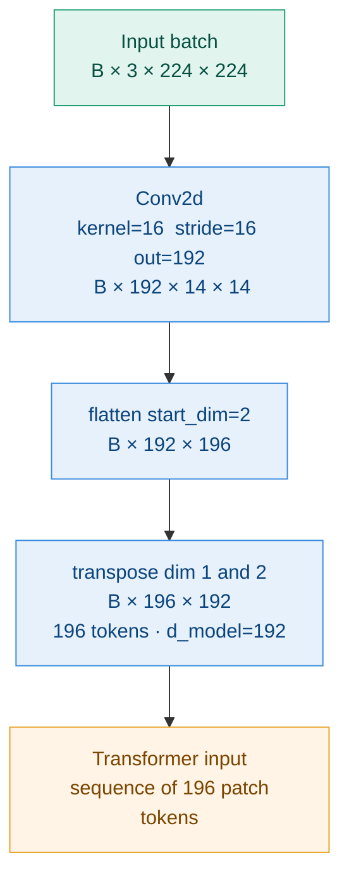
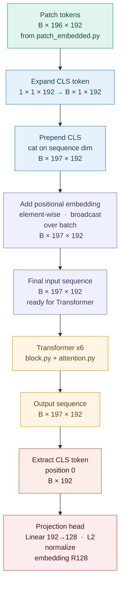

# Code Architecture

## Data Initialization



```
train_label.xml       ← source of labels (vehicleID, cameraID) for each image
      ↓
data_transforms.py    ← two transform pipelines passed to the Dataset constructor
                            train : crop · flip · jitter · blur · erase · normalize
      ↓                     test  : resize · normalize — deterministic, required for kNN

dataset.py            ← reads XML, loads images on the fly, returns (tensor, vid, cid)
                         self.samples[i] = (img_path, vehicle_id, camera_id)
      ↓                  self.labels[i]  = vehicle_id — only attribute consumed by PKSampler

batch.py              ← receives dataset.labels, groups indices by vehicle_id
                         samples P=16 identities × K=4 images per batch
      ↓                  guarantees 3 positives and 60 negatives per anchor for the triplet loss

dataloader.py         ← wraps dataset + PKSampler into a PyTorch DataLoader
                            train : drop_last=True  — incomplete batch breaks the triplet loss
                            query/test : shuffle=False — fixed order required for kNN
```

## Model Construction
The model is a Vision Transformer (ViT-Tiny) trained from scratch.
It maps each input image to a 128-dimensional embedding vector.

### Patch Embedding

#### Theory

A Transformer expects a **sequence of vectors** as input.
An image is not a sequence — it is a 2D grid of pixels.
Patch embedding is the operation that converts a 2D image into a 1D sequence of tokens.

**Reference:** lec7 pages 51–53 (Dosovitskiy et al., "An Image is Worth 16x16 Words", 2020)

#### Key formula

$$N = \frac{H \times W}{P^2} = \frac{224 \times 224}{16^2} = 196 \text{ tokens}$$

Each patch covers `P×P = 16×16` pixels across 3 RGB channels = 768 raw values.
A linear projection maps those 768 values down to `d_model = 192` — the working
dimension of the Transformer throughout the entire network.

### Why Conv2d instead of manual splitting

A manual split followed by a linear layer would be two separate operations.
`Conv2d(in=3, out=192, kernel=16, stride=16)` performs both in a single GPU pass:
- `kernel=16` covers exactly one 16×16 patch
- `stride=16` moves by exactly one patch — no overlap, no gap
- `out=192` is the linear projection learned during training

---

#### Tensor flow

```
Input batch        :  (B,   3, 224, 224)

Conv2d k=16 s=16   :  (B, 192,  14,  14)   ← 196 patch positions on a 14×14 grid

flatten(start=2)   :  (B, 192, 196)         ← spatial grid → flat sequence

transpose(1, 2)    :  (B, 196, 192)         ← (batch, seq_len, d_model)
                                               ready for the Transformer
```

---

#### Diagram


---

#### Parameters summary

| Parameter | Value | Derived from |
|---|---|---|
| `img_size` | 224 | ImageNet convention |
| `patch_size` | 16 | `O(N²)` attention — patch=8 would 4× memory |
| `in_channels` | 3 | RGB |
| `d_model` | 192 | ViT-Tiny standard width |
| `num_patches` | 196 | `(224/16)² = 14² = 196` |
| Conv2d params | 3×16×16×192 = 147 456 | learned projection weights |

## CLS Token + Positional Embedding
#### The problem

After patch embedding we have a sequence of 196 tokens `(B, 196, 192)`.
After the Transformer encoder, we still have 196 tokens.
We need **one single vector per image** to feed the projection head and compute the triplet loss.

---

#### Why not GAP

GAP averages all 196 tokens after the Transformer into a single vector.
Every patch contributes equally to the final representation — the model cannot
learn that certain spatial regions are more discriminative than others.
For vehicle Re-ID, identity cues are spatially localized: logo, wheel shape, body lines.
Uniform averaging discards this spatial hierarchy.

GAP is also incompatible with DINOv3 pre-trained weights, which were trained with a CLS token.

---

#### CLS token

The CLS token is a learnable vector (`nn.Parameter`, shape `1×192`) prepended
to the patch sequence before the Transformer. It has no spatial meaning — it is
a dedicated slot that aggregates information from all other tokens through
attention across all 6 Transformer layers.

```
Before Transformer :  [CLS,  p1,  p2, ..., p196]   →  197 × 192
After  Transformer :  [CLS', p1', p2', ..., p196']  →  197 × 192
                        ↑
                   only this token is extracted
```

The model learns which patches to attend to and how much weight to give each one.
Over training, the CLS token naturally focuses attention on discriminative regions
rather than background.

At forward time, the single stored CLS token `(1, 1, 192)` is expanded to match
the batch size `(B, 1, 192)` and prepended to the patch sequence along the
sequence dimension — producing a sequence of 197 tokens.

---

#### Positional embedding

Self-attention is **permutation-invariant** — it only depends on dot products
between token vectors, not their order in the sequence. Without positional
information the Transformer treats every patch position identically.

The positional embedding is an `nn.Parameter` of shape `1×197×192` added
element-wise to the full sequence including the CLS token. It is learned
during training rather than fixed sinusoidal, which gives the model flexibility
to discover the most useful spatial encoding for vehicle images.

$$x_i \leftarrow x_i + e_i^{pos} \quad \forall i \in \{0, 1, \ldots, 196\}$$

Because the positional embedding is stored with a batch dimension of 1, PyTorch
broadcasting automatically applies it identically to every image in the batch.

### Initialization

Both `cls_token` and `pos_embed` are initialized with `trunc_normal(std=0.02)` —
a truncated normal distribution clipped at ±2σ. Small initial values keep
activations stable at the start of training and prevent exploding signals
through the residual connections.

---

#### Full sequence transformation



---

#### Key operations

| Step | Operation | Input shape | Output shape |
|---|---|---|---|
| Expand CLS | expand to batch size | `1 × 1 × 192` | `B × 1 × 192` |
| Prepend CLS | concatenate on sequence dim | `B × 196 × 192` | `B × 197 × 192` |
| Add pos embed | element-wise addition | `B × 197 × 192` | `B × 197 × 192` |
| After Transformer | attention output | `B × 197 × 192` | `B × 197 × 192` |
| Extract CLS | slice position 0 | `B × 197 × 192` | `B × 192` |
| Projection head | Linear + L2 normalize | `B × 192` | `B × 128` |

---

#### Parameters

| Parameter | Shape | Init |
|---|---|---|
| `cls_token` | `1 × 1 × 192` | `trunc_normal std=0.02` |
| `pos_embed` | `1 × 197 × 192` | `trunc_normal std=0.02` |

---

#### GAP as ablation (optional)

Instead of extracting the CLS token at position 0, average the 196 patch tokens
(positions 1 to 196) along the sequence dimension. This produces the same output
shape `(B, 192)` and can be swapped in with a single line change to measure the
contribution of the CLS token to final mAP.

## Train and Evaluate Process

## Test and Monitoring

### Losses

### Gradients
