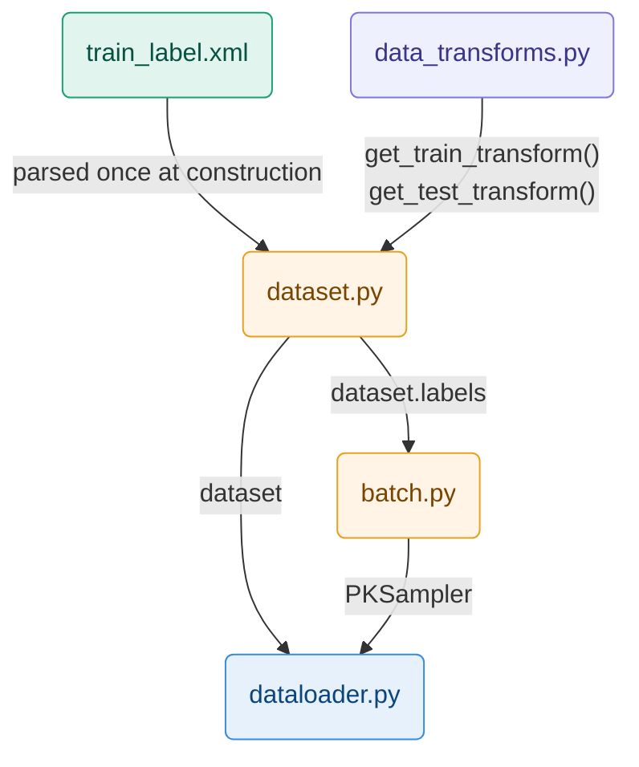
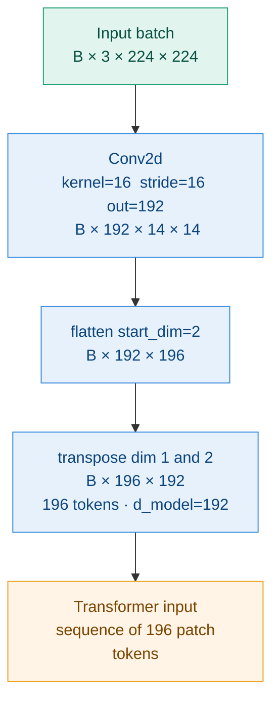

# Code Architecture

## Data Initialization



```
train_label.xml       ← source of labels (vehicleID, cameraID) for each image
      ↓
data_transforms.py    ← two transform pipelines passed to the Dataset constructor
                            train : crop · flip · jitter · blur · erase · normalize
      ↓                     test  : resize · normalize — deterministic, required for kNN

dataset.py            ← reads XML, loads images on the fly, returns (tensor, vid, cid)
                         self.samples[i] = (img_path, vehicle_id, camera_id)
      ↓                  self.labels[i]  = vehicle_id — only attribute consumed by PKSampler

batch.py              ← receives dataset.labels, groups indices by vehicle_id
                         samples P=16 identities × K=4 images per batch
      ↓                  guarantees 3 positives and 60 negatives per anchor for the triplet loss

dataloader.py         ← wraps dataset + PKSampler into a PyTorch DataLoader
                            train : drop_last=True  — incomplete batch breaks the triplet loss
                            query/test : shuffle=False — fixed order required for kNN
```

## Model Construction
Blablabla

### Patch Embedding

#### Theory

A Transformer expects a **sequence of vectors** as input.
An image is not a sequence — it is a 2D grid of pixels.
Patch embedding is the operation that converts a 2D image into a 1D sequence of tokens.

**Reference:** lec7 pages 51–53 (Dosovitskiy et al., "An Image is Worth 16x16 Words", 2020)

#### Key formula

$$N = \frac{H \times W}{P^2} = \frac{224 \times 224}{16^2} = 196 \text{ tokens}$$

Each patch covers `P×P = 16×16` pixels across 3 RGB channels = 768 raw values.
A linear projection maps those 768 values down to `d_model = 192` — the working
dimension of the Transformer throughout the entire network.

### Why Conv2d instead of manual splitting

A manual split followed by a linear layer would be two separate operations.
`Conv2d(in=3, out=192, kernel=16, stride=16)` performs both in a single GPU pass:
- `kernel=16` covers exactly one 16×16 patch
- `stride=16` moves by exactly one patch — no overlap, no gap
- `out=192` is the linear projection learned during training

---

#### Tensor flow

```
Input batch        :  (B,   3, 224, 224)

Conv2d k=16 s=16   :  (B, 192,  14,  14)   ← 196 patch positions on a 14×14 grid

flatten(start=2)   :  (B, 192, 196)         ← spatial grid → flat sequence

transpose(1, 2)    :  (B, 196, 192)         ← (batch, seq_len, d_model)
                                               ready for the Transformer
```

---

#### Diagram


---

#### Parameters summary

| Parameter | Value | Derived from |
|---|---|---|
| `img_size` | 224 | ImageNet convention |
| `patch_size` | 16 | `O(N²)` attention — patch=8 would 4× memory |
| `in_channels` | 3 | RGB |
| `d_model` | 192 | ViT-Tiny standard width |
| `num_patches` | 196 | `(224/16)² = 14² = 196` |
| Conv2d params | 3×16×16×192 = 147 456 | learned projection weights |

## Train and Evaluate Process

## Test and Monitoring

### Losses

### Gradients
