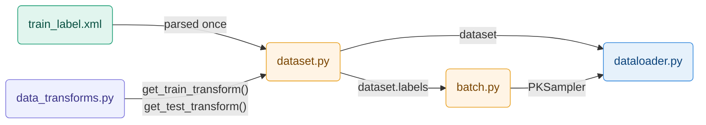

# Data Initialization

## Overview

This module handles everything between raw files on disk and a batch of tensors
ready for the model. Four files with strictly separated responsibilities.

| File | Role |
|---|---|
| `data/data_transforms.py` | Two image preprocessing pipelines — randomized for train, deterministic for query/test |
| `data/dataset.py` | Reads the XML annotation file, loads images on the fly, exposes the PyTorch Dataset interface |
| `data/batch.py` | Controlled P×K batch construction required by the triplet loss |
| `data/dataloader.py` | Wraps dataset + sampler into PyTorch DataLoaders — one per split |



---

## Data Augmentation — `data/data_transforms.py`

Augmentation is applied **online** — at each call to `__getitem__`, a fresh
random transform is applied to the image. No new files are created on disk.
The model sees a statistically different version of each image at every epoch.

Two purposes: **regularization** (prevents memorizing exact pixel values) and
**invariance** (teaches the model to ignore variations that exist across cameras —
lighting, blur, partial occlusion).

### Training pipeline

| Step | Transform | Purpose |
|---|---|---|
| 1 | `RandomResizedCrop scale=(0.6, 1.0)` | Imperfect detection crop simulation |
| 2 | `RandomHorizontalFlip p=0.5` | Lateral symmetry — no vertical flip |
| 3 | `ColorJitter brightness=0.3 hue=0.05` | Cross-camera lighting variance |
| 4 | `GaussianBlur sigma=(0.1, 0.5)` | Low-quality or motion-blurred cameras |
| 5 | `ToTensor` | PIL HWC uint8 → PyTorch CHW float32 |
| 6 | `Normalize` ImageNet stats | Equal variance across channels |
| 7 | `RandomErasing p=0.5` | Occlusion simulation — forces global representation |

`ToTensor` is the mandatory boundary — `Normalize` and `RandomErasing` require
tensors and cannot appear before it.

### Test pipeline

`Resize → ToTensor → Normalize` — fully deterministic. Query and gallery
embeddings must be identical across runs for kNN retrieval to be reproducible.
The normalization constants must be strictly identical to training:

$$\text{pixel}_{\text{norm}} = \frac{\text{pixel} - \mu}{\sigma}, \quad \mu = [0.485,\ 0.456,\ 0.406], \quad \sigma = [0.229,\ 0.224,\ 0.225]$$

---

## Dataset — `data/dataset.py`

Implements the standard PyTorch `Dataset` interface. Reads `train_label.xml`
once at construction and builds two parallel lists:

```
self.samples[i] = (img_path, vehicle_id, camera_id)
self.labels[i]  = vehicle_id
```

`self.labels[i]` is always the `vehicle_id` of `self.samples[i]`.
`PKSampler` reads only `self.labels` — it never touches image files.

`vehicleID` defaults to `-1` when absent — `query_label.xml` and `test_label.xml`
do not carry `vehicleID` because it is the ground truth to predict. Providing it
as input would be data leakage.

---

## Batch Construction — `data/batch.py`

### Why PKSampler

Standard random shuffle cannot guarantee that multiple images of the same vehicle
appear together in a batch. The batch-hard triplet loss requires it — it mines
the hardest positive and hardest negative **within the batch**.

PKSampler guarantees every batch contains exactly:

| | Value | Formula |
|---|---|---|
| Identities per batch | 16 | P |
| Images per identity | 4 | K |
| Batch size | 64 | P × K |
| Positives per anchor | 3 | K − 1 |
| Negatives per anchor | 60 | (P − 1) × K |

### Algorithm

At construction — ```_build_index``` groups all dataset indices by identity:

$$\text{index per identity[vid]} = [idx₁, idx₂, idx₃, ...]$$

At each epoch — ```__iter__``` shuffles the 440 identities, slices P at a time,
samples K indices per identity, yields all P×K indices as a flat sequence.

$$\text{num}_\text{batches} = \lfloor 440/16 \rfloor = 27 \quad \Rightarrow \quad 27 \times 64 = 1728 \text{images per epoch}$$

Not all 52 717 images are seen every epoch — coverage builds across epochs as
identities are reshuffled.

---

## DataLoaders — ```data/dataloader.py```

Three functions, one per split. The differences are deliberate:

| | Train | Query | Test |
|---|---|---|---|
| Sampler | PKSampler | none | none |
| `shuffle` | forbidden | `False` | `False` |
| `drop_last` | `True` | `False` | `False` |
| `batch_size` | 64 | 128 | 128 |

`drop_last=True` for train — an incomplete batch has fewer than P×K images and
breaks the triplet loss structure.

`shuffle=False` for query and test — embeddings are stored sequentially and
matched by position against ground-truth labels. Any reordering corrupts kNN.

`pin_memory=True` on all three — keeps tensors in page-locked CPU memory,
which the GPU can access directly via DMA without OS scheduling overhead.
