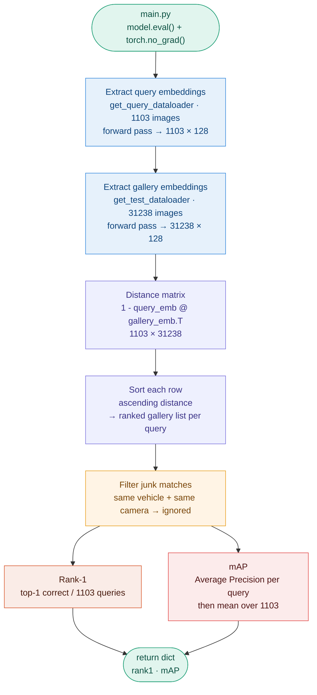

# Evaluation — `engine/evaluate.py`

## Overview

Evaluation runs after each epoch (or every N epochs) in `main.py`.
It extracts embeddings for all query and gallery images, computes the
distance matrix, and returns Rank-1 and mAP — the two official metrics
of the AI City Challenge 2021.

**Target : beat the 36.0% val mAP cross-entropy baseline of the 2021 winners.**

---

## The evaluation protocol

Same vehicle + same camera = **ignored** (junk match).
Same vehicle + different camera = **true positive**.
This enforces genuine cross-camera retrieval — the core of the challenge.

---

## Full evaluation flow



---

## Step 1 — Extract embeddings

`model.eval()` disables dropout — embeddings are deterministic and reproducible
across runs. This is mandatory for kNN retrieval: if dropout randomly zeros activations,
two forward passes of the same image produce different embeddings and distances are meaningless.

`torch.no_grad()` disables gradient computation entirely — no computation graph is built.
This halves memory usage and significantly speeds up inference since PyTorch no longer
tracks operations for backpropagation.

Both query and gallery use `get_test_transform()` — deterministic resize and normalize,
no augmentation, full vehicle always visible. The normalization constants are strictly
identical to training — a mismatch would shift all embeddings and corrupt the distances.

---

## Step 2 — Distance matrix

All embeddings are L2-normalized (`‖f(x)‖ = 1`) — cosine distance equals euclidean distance.
The full `1103 × 31238` distance matrix is computed in one matrix multiplication:

$$D = 1 - \mathbf{Q} \cdot \mathbf{G}^T \quad \in \mathbb{R}^{1103 \times 31238}$$

where $\mathbf{Q} \in \mathbb{R}^{1103 \times 128}$ are query embeddings and
$\mathbf{G} \in \mathbb{R}^{31238 \times 128}$ are gallery embeddings.

$D_{ij}$ = distance between query $i$ and gallery image $j$.
Lower = more similar. Sorting each row ascending gives the ranked gallery list.

---

## Step 3 — Rank-1

For each query, check if the top-1 retrieved image shows the same vehicle
on a **different camera** (junk matches are skipped):

$$\text{Rank-1} = \frac{1}{1103} \sum_{i=1}^{1103} \mathbf{1}[\text{top-1}(i) \text{ is correct}]$$

Simple and interpretable — but only evaluates the first position.
Two models with identical Rank-1 can behave very differently at ranks 2-50.

---

## Step 4 — mAP

For each query $i$, compute the Average Precision (AP) — the area under the
precision-recall curve across all retrieved gallery images:

$$\text{AP}_i = \frac{1}{R_i} \sum_{k=1}^{K} P(k) \cdot \text{rel}(k)$$

- $R_i$ — total number of relevant gallery images for query $i$
- $k$ — rank position
- $P(k)$ — precision at rank $k$ = fraction of correct results in top-$k$
- $\text{rel}(k)$ — 1 if the image at rank $k$ is correct, 0 otherwise

$$\text{mAP} = \frac{1}{1103} \sum_{i=1}^{1103} \text{AP}_i$$

**Concrete example** — query véhicule #3, 4 correct images in gallery :

```
rank 1 : ✓  →  P(1) = 1/1 = 1.00
rank 2 : ✗
rank 3 : ✓  →  P(3) = 2/3 = 0.67
rank 4 : ✗
rank 5 : ✓  →  P(5) = 3/5 = 0.60
rank 9 : ✓  →  P(9) = 4/9 = 0.44

AP = (1.00 + 0.67 + 0.60 + 0.44) / 4 = 0.68
```

A model that returns all correct images at ranks 1-4 would get AP = 1.0.
A model that returns them at ranks 1, 10, 20, 30 would get a much lower AP.
mAP rewards models that rank all correct images near the top — not just the first one.

---

## Why mAP is the primary metric

Each vehicle in the gallery has **multiple images** (different cameras, tracks).
Rank-1 only checks if one of them is at position 1.
mAP checks if **all** of them are ranked high.

For a surveillance system, retrieving all views of a suspect vehicle matters more
than just finding one — mAP captures this requirement directly.
The challenge leaderboard ranks submissions by mAP, not Rank-1.

---

## Return value

`evaluate()` returns a dict with two floats — `rank1` and `mAP` — both in `[0, 1]`.
`main.py` saves a checkpoint when `mAP` exceeds the previous best value seen during training.

---

## References

| Source | Link |
|---|---|
| AI City Challenge 2021 — evaluation protocol | https://www.aicitychallenge.org/2021-evaluation-system/ |
