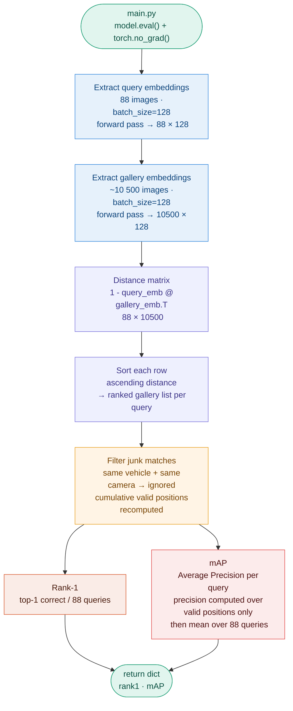

# Evaluation — `engine/evaluate.py`

## Overview

Evaluation runs every 10 epochs in `main.py`.
It extracts embeddings for all query and gallery images, computes the
distance matrix, and returns Rank-1 and mAP — the two official metrics
of the AI City Challenge 2021.

**Target : beat the 36.0% val mAP cross-entropy baseline of the 2021 winners.**

Since the official test ground truth is withheld by the competition organisers,
we evaluate on a **local validation split** constructed from `train_label.xml`:
88 held-out identities — never seen during training — serve as query and gallery.
The remaining 352 identities are used exclusively for training.

---

## The evaluation protocol

Same vehicle + same camera = **ignored** (junk match).
Same vehicle + different camera = **true positive**.
This enforces genuine cross-camera retrieval — the core of the challenge.

**Why ignore same-camera matches ?**
If a vehicle is photographed multiple times by the same camera, those images
are near-duplicates — retrieving them requires no understanding of vehicle identity,
just texture matching. Ignoring them forces the model to generalize across viewpoints
and lighting conditions.

---

## Local validation split

```
train_label.xml (440 identities, 52 717 images)
    │
    ├── train_ds   (352 identities, ~42 200 images)  ← training only, never evaluated
    │
    ├── query_ds   (88 identities,  88 images)        ← 1 image per held-out identity
    │
    └── gallery_ds (88 identities, ~10 500 images)    ← remaining images of held-out ids
```

The split is deterministic — fixed `seed=42` in `make_train_eval_split()`.
The same 88 identities are always held out across all runs, making metrics
directly comparable between experiments.

**Why 88 identities ?**
This follows the evaluation protocol of the 2021 winners, who used a similar
fraction of training identities for local validation. 88/440 = 20% provides
enough queries for statistically meaningful mAP while preserving 80% of
identities for training diversity.

---

## Full evaluation flow



---

## Step 1 — Extract embeddings

`model.eval()` disables dropout — embeddings are deterministic and reproducible
across runs. This is mandatory for kNN retrieval: if dropout randomly zeros activations,
two forward passes of the same image produce different embeddings and distances are meaningless.

`torch.no_grad()` disables gradient computation entirely — no computation graph is built.
This halves memory usage and significantly speeds up inference since PyTorch no longer
tracks operations for backpropagation.

Both query and gallery use `get_test_transform()` — deterministic resize and normalize,
no augmentation, full vehicle always visible. The normalization constants are strictly
identical to training — a mismatch would shift all embeddings and corrupt the distances.

---

## Step 2 — Distance matrix

All embeddings are L2-normalized (`‖f(x)‖ = 1`) — cosine distance equals euclidean distance.
The full distance matrix is computed in one matrix multiplication:

$$D = 1 - \mathbf{Q} \cdot \mathbf{G}^T \quad \in \mathbb{R}^{88 \times 10500}$$

where $\mathbf{Q} \in \mathbb{R}^{88 \times 128}$ are query embeddings and
$\mathbf{G} \in \mathbb{R}^{10500 \times 128}$ are gallery embeddings.

$D_{ij}$ = distance between query $i$ and gallery image $j$.
Lower = more similar. Sorting each row ascending gives the ranked gallery list.

---

## Step 3 — Rank-1

For each query, check if the top-1 retrieved image shows the same vehicle
on a **different camera** (junk matches are skipped):

$$\text{Rank-1} = \frac{1}{88} \sum_{i=1}^{88} \mathbf{1}[\text{top-1 valid}(i) \text{ is correct}]$$

Simple and interpretable — but only evaluates the first position.
Two models with identical Rank-1 can behave very differently at deeper ranks.

---

## Step 4 — mAP

For each query $i$, compute the Average Precision (AP) over **valid positions only**
(same-camera matches excluded from the ranked list):

$$\text{AP}_i = \frac{1}{R_i} \sum_{k=1}^{K} P_{\text{valid}}(k) \cdot \text{rel}(k)$$

- $R_i$ — total number of relevant gallery images for query $i$
- $k$ — rank position among valid (non-junk) results
- $P_{\text{valid}}(k)$ — precision at valid rank $k$
- $\text{rel}(k)$ — 1 if the image at valid rank $k$ is correct, 0 otherwise

$$\text{mAP} = \frac{1}{88} \sum_{i=1}^{88} \text{AP}_i$$

**Correct AP computation — positions among valid items only:**

The junk mask is removed before computing positions. `cumulative_valid` tracks
the running count of non-junk items seen so far, so each true positive's position
is its rank among valid results only — not its absolute position in the full gallery.

This matters: if a junk match appears at rank 1 and the first true positive at rank 2,
the correct AP counts it at valid position 1 (not 2). Counting absolute positions
would unfairly penalize the model for matches it is explicitly told to ignore.

**Concrete example** — query vehicle #3, 3 correct images in gallery, 1 junk at rank 1:

```
rank 1 : ✗ junk (same camera) → ignored
rank 2 : ✓ valid → valid pos 1 → P_valid(1) = 1/1 = 1.00
rank 3 : ✗ wrong
rank 4 : ✓ valid → valid pos 3 → P_valid(3) = 2/3 = 0.67
rank 6 : ✓ valid → valid pos 5 → P_valid(5) = 3/5 = 0.60

AP = (1.00 + 0.67 + 0.60) / 3 = 0.76
```

Without the junk correction, the first true positive would be counted at
absolute position 2 instead of valid position 1 — AP would be artificially lower.

---

## Why mAP is the primary metric

Each vehicle in the gallery has **multiple images** (different cameras, tracks).
Rank-1 only checks if one of them is at position 1.
mAP checks if **all** of them are ranked high.

For a surveillance system, retrieving all views of a suspect vehicle matters more
than just finding one — mAP captures this requirement directly.
The challenge leaderboard ranks submissions by mAP, not Rank-1.

---

## Evaluation artefact — what we fixed

Early runs (run_001 to run_003) reported mAP = 87-100% from epoch 1, which was
clearly impossible for an untrained model. Two bugs were identified and corrected:

**1. Missing vehicleID in official splits** — `query_label.xml` and `test_label.xml`
do not carry `vehicleID`. The parser defaulted to `-1` for all images, making
every gallery image appear as a match for every query. The fix was to use the
local validation split from `train_label.xml` where vehicleIDs are real.

**2. AP computed over absolute positions** — the original code computed precision
at absolute gallery positions rather than valid-only positions. Junk matches at the
top of the ranking inflated the denominator and produced artificially high AP.
The fix uses `cumulative_valid` to reindex positions among non-junk items only.

---

## References

| Source | Link |
|---|---|
| AI City Challenge 2021 — evaluation protocol | https://www.aicitychallenge.org/2021-evaluation-system/ |
| 2021 winners — local validation protocol | https://github.com/michuanhaohao/AICITY2021_Track2_DMT |
