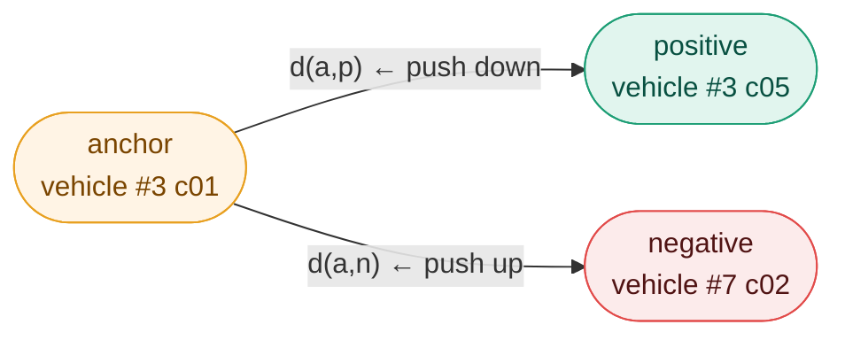

# Triplet Loss — `losses/tripletloss.py`

## Why not cross-entropy
 
In classical ML, the loss is often grounded in **maximum likelihood estimation** —
cross-entropy is the negative log-likelihood of a probabilistic model assigning
the correct class. This works when there is a fixed, known set of classes and a
natural probability distribution to maximize.
 
Vehicle Re-ID has neither. The 440 test identities are **never seen during training**
— the model cannot memorize class labels. More fundamentally, there is no natural
probability distribution to model here. What we have instead is a **geometric
constraint**: embeddings of the same vehicle must be closer together than embeddings
of different vehicles.
 
The triplet loss translates this constraint directly into a gradient signal —
no probability, no class distribution, just distances in an embedding space.
This is **metric learning**: learning a distance function rather than a classifier.
 
What we need instead is a model that produces embeddings where:

```
same vehicle,  different camera  →  embeddings close together
different vehicles               →  embeddings far apart
```

This is **metric learning** — learning a distance, not a classification.

---

## The triplet

A triplet is a group of 3 images:

$$(\mathbf{a},\ \mathbf{p},\ \mathbf{n}) \quad \text{where} \quad y_a = y_p \neq y_n$$

| Role | Name | Example |
|---|---|---|
| **a** — Anchor | reference image | vehicle #3, camera c01 |
| **p** — Positive | same identity, different camera | vehicle #3, camera c05 |
| **n** — Negative | different identity | vehicle #7, camera c02 |

The objective: push $d(a,p)$ down and $d(a,n)$ up simultaneously.

---

## The triplet loss

$$\mathcal{L}_{\text{triplet}} = \max\left(0,\ d(a,p) - d(a,n) + \alpha\right)$$

- $d(a,p)$ — distance between anchor and positive
- $d(a,n)$ — distance between anchor and negative
- $\alpha = 0.15$ — margin: a safety buffer between the two distances



**When loss = 0 :** $d(a,n) - d(a,p) > \alpha$ — the negative is far enough, no gradient.

**When loss > 0 :** $d(a,n) - d(a,p) < \alpha$ — the negative is too close, the model learns.

The margin $\alpha = 0.15$ forces a minimum separation gap. Without it the model could
satisfy $d(a,p) < d(a,n)$ by just a tiny epsilon and stop learning. On L2-normalized
embeddings, 0.15 corresponds to a moderate angular separation on the unit hypersphere —
tight enough to be achievable from scratch, large enough to enforce meaningful separation.

---

## Representation Collapse — the critical failure mode

Training a ViT from scratch with triplet loss alone leads to **representation collapse**:
all embeddings converge to the same point on the hypersphere.

When all vectors point in the same direction, every pairwise distance approaches zero:
$d(a,p) \approx 0$ and $d(a,n) \approx 0$. The triplet loss becomes
$\max(0, 0 - 0 + 0.15) = 0.15$ — nearly satisfied, with small gradients that
reinforce the collapse rather than fighting it.

The model has found a degenerate solution: it maps every vehicle to the same
embedding, which trivially satisfies the loss without learning anything discriminative.

This is exactly what happened in our first training runs (run_001 to run_003),
where the Triplet Health monitor reported `⚠ COLLAPSE` with `d(a,p) ≈ d(a,n) ≈ 0`
from epoch 9 onward, and the mAP of 87% was revealed to be an evaluation artefact.

---

## Uniformity Loss — collapse prevention

To prevent collapse, we add a **uniformity regularization term** from
Wang et al. (2020) that penalizes embeddings clustering together on the hypersphere:

$$\mathcal{L}_{\text{unif}} = \log \frac{1}{\binom{B}{2}} \sum_{i < j} e^{-2\|z_i - z_j\|^2}$$

**Intuition:** the Gaussian kernel $e^{-2\|z_i - z_j\|^2}$ is close to 1 when two
embeddings are nearby and close to 0 when they are far apart. The log-mean of all
pairwise kernels measures how clustered the embeddings are:

- If all embeddings collapse to one point → all distances → 0 → all kernels → 1 → log(1) = 0 ← **high penalty**
- If embeddings are spread uniformly → distances large → kernels → 0 → log(~0) → -∞ ← **low penalty (good)**

The uniformity loss is always negative by construction — it decreases as the
hypersphere is used more uniformly. This is not a bug: it acts as a **repulsive force**
pushing all embeddings apart regardless of identity, making the degenerate
all-same-point solution impossible.

**Numerical stability:** the naive implementation `log(mean(exp(...)))` is numerically
unstable. We use `logsumexp` which applies the log-sum-exp trick internally:

$$\mathcal{L}_{\text{unif}} = \text{logsumexp}(-2\|z_i - z_j\|^2) - \log\binom{B}{2}$$

---

## Combined objective

$$\mathcal{L}_{\text{total}} = \mathcal{L}_{\text{triplet}} + \lambda_{\text{unif}} \cdot \mathcal{L}_{\text{unif}}$$

with $\lambda_{\text{unif}} = 0.05$ — small enough to let the triplet loss dominate
and drive identity separation, large enough to prevent collapse.

| Loss component | Sign | Role |
|---|---|---|
| $\mathcal{L}_{\text{triplet}}$ | ≥ 0 | pulls same-identity embeddings together, pushes different ones apart |
| $\mathcal{L}_{\text{unif}}$ | ≤ 0 | pushes ALL embeddings apart uniformly — prevents collapse |
| $\mathcal{L}_{\text{total}}$ | can be negative | sum dominated by uniformity when embeddings are well-spread |

The total loss becomes negative when the model has learned to spread embeddings
well on the hypersphere — this is a healthy sign, not a bug.

---

## The problem with random triplets

With 52 717 images and 440 identities, the number of possible triplets is in the
billions. The vast majority are **easy** — a red sedan and a blue truck are already
far apart from the very first epoch. Their gradient is nearly zero and teaches
the model nothing.

Training on random triplets = 99% of compute wasted on uninformative gradients.

---

## Batch-Hard Mining

**Reference:** Hermans et al., *"In Defense of the Triplet Loss for Person Re-Identification"*, 2017.
Vehicle Re-ID reuses the same strategy — identical problem, different object class.

For each anchor in the batch, instead of a random triplet, mine the **hardest**:

$$\mathcal{L}_{\text{batch-hard}} = \sum_{i=1}^{B} \max\left(0,\ \underbrace{\max_{p:\ y_p = y_i} d(i,p)}_{\text{hardest positive}} - \underbrace{\min_{n:\ y_n \neq y_i} d(i,n)}_{\text{hardest negative}} + \alpha\right)$$

| | Definition | Intuition |
|---|---|---|
| **Hardest positive** | the positive **farthest** from the anchor | worst photo of the same vehicle — bad angle, heavy occlusion |
| **Hardest negative** | the negative **closest** to the anchor | most similar-looking different vehicle in the batch |

Every gradient step resolves the most ambiguous cases available — no wasted compute.

---

## Why PKSampler is mandatory

Batch-hard mining requires at least **one positive per anchor** in the batch.
With random shuffle, a batch might contain only one image per identity — no positive
to mine. The entire data pipeline was designed around this constraint:

```
PKSampler  →  P=20 identities × K=8 images  →  batch of 160
                                                  ↓
                              each anchor has K-1 = 7 positives
                              each anchor has (P-1)×K = 152 negatives
```

---

## The embedding space — unit hypersphere

The projection head in `vit.py` applies `F.normalize(x, dim=-1)` — every embedding
vector is divided by its L2 norm, forcing $\|f(x)\| = 1$.

**What this means geometrically:** all 128-dimensional embedding vectors lie on the
surface of a sphere of radius 1. The magnitude of a vector carries no information —
only its **direction** encodes vehicle identity.

```
Without L2 norm :           With L2 norm :

  *    *                        *  *
 *  *   *         →          *        *   ← all on the surface
   * *  *                   *    •     *   ← • = origin (0,0)
 *     *                      *      *
                                *  *

Points scattered              Points on the sphere
at arbitrary distances        at distance 1 from origin
```

**Why euclidean distance = cosine distance on the unit hypersphere:**

Cosine similarity measures the angle between two vectors. Euclidean distance
measures the straight-line gap between two points. On the unit hypersphere,
they are algebraically linked:

$$\|f(a) - f(p)\|^2 = \|f(a)\|^2 + \|f(p)\|^2 - 2 \cdot f(a)^T f(p) = 1 + 1 - 2 \cdot f(a)^T f(p)$$

$$d(a,p) = \sqrt{2 - 2 \cdot f(a)^T f(p)}$$

Comparing euclidean distances is therefore exactly equivalent to comparing angles —
both metrics rank neighbors in the same order.

Three practical benefits:

| Benefit | Explanation |
|---|---|
| **Stability** | All vectors have the same magnitude — the model cannot cheat by inflating a vector's norm |
| **Uniform comparison** | A "confident" embedding does not dominate just because it is large |
| **Fast computation** | The full distance matrix reduces to a single matrix product: `1 - F @ F.T` |

---

## Active triplets — training health metric

When loss = 0 for a triplet, it contributes no gradient → **inactive triplet**.
The fraction of active triplets is the key health signal monitored in
`monitoring/triplet_health.py`:

```
start of training  :  ~100% active  →  everything is hard, fast learning
mid training       :  ~90-95% active →  model is making progress
end of training    :  ~85-90% active →  hard cases remain, model still learning
```

If the active fraction drops to 0% early — the margin is too small.
If it stays at 100% indefinitely — representation collapse is occurring.

---

## Summary

| Concept | Value | Why |
|---|---|---|
| Loss type | Batch-hard triplet + uniformity | mines hardest cases, prevents collapse |
| Margin $\alpha$ | 0.15 | achievable from scratch, enforces meaningful separation |
| Uniformity weight $\lambda$ | 0.05 | collapse prevention without dominating triplet signal |
| Distance | Euclidean on L2-normalized vectors | equivalent to cosine, fast to compute |
| Mining scope | within the batch | efficient, no global pass needed |
| Batch structure | P=20 × K=8 = 160 | guarantees 7 positives + 152 negatives per anchor |

---

## References

| Source | Link |
|---|---|
| Hermans et al., 2017 — Batch-Hard Mining | https://arxiv.org/abs/1703.07737 |
| Wang et al., 2020 — Uniformity Loss | https://arxiv.org/abs/2005.10242 |
| AI City Challenge 2021 — baseline 36% mAP | https://www.aicitychallenge.org/2021-evaluation-system/ |
| lec1 — Empirical risk minimization | lec1.pdf |
| lec4 — Mini-batching and gradient descent | lec4.pdf page 14 |
