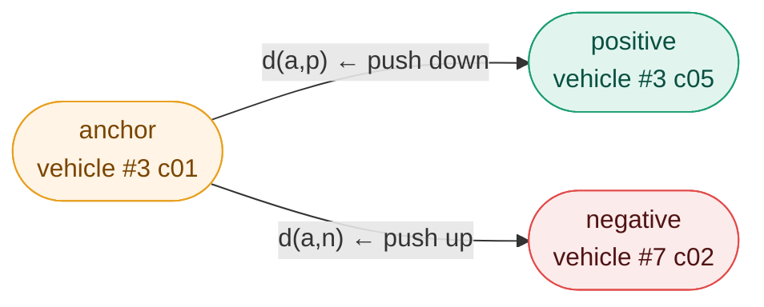

# Triplet Loss — `losses/triplet.py`

## Why not cross-entropy

The challenge requires **retrieval** — given a query vehicle, find the same vehicle
among 31 238 gallery images. Cross-entropy learns to predict a fixed set of classes.
Here the 440 test identities are **never seen during training** — the model cannot
memorize class labels.

What we need instead is a model that produces embeddings where:

```
same vehicle,  different camera  →  embeddings close together
different vehicles               →  embeddings far apart
```

This is **metric learning** — learning a distance, not a classification.

---

## The triplet

A triplet is a group of 3 images:

$$(\mathbf{a},\ \mathbf{p},\ \mathbf{n}) \quad \text{where} \quad y_a = y_p \neq y_n$$

| Role | Name | Example |
|---|---|---|
| **a** — Anchor | reference image | vehicle #3, camera c01 |
| **p** — Positive | same identity, different camera | vehicle #3, camera c05 |
| **n** — Negative | different identity | vehicle #7, camera c02 |

The objective: push $d(a,p)$ down and $d(a,n)$ up simultaneously.

---

## The triplet loss

$$\mathcal{L} = \max\left(0,\ d(a,p) - d(a,n) + \alpha\right)$$

- $d(a,p)$ — distance between anchor and positive
- $d(a,n)$ — distance between anchor and negative
- $\alpha = 0.3$ — margin: a safety buffer between the two distances



**When loss = 0 :** $d(a,n) - d(a,p) > \alpha$ — the negative is far enough, no gradient.

**When loss > 0 :** $d(a,n) - d(a,p) < \alpha$ — the negative is too close, the model learns.

The margin $\alpha = 0.3$ forces a minimum separation gap. Without it the model could
satisfy $d(a,p) < d(a,n)$ by just a tiny epsilon and stop learning. 0.3 corresponds
to a separation of approximately 17° on the unit hypersphere for L2-normalized embeddings.

---

## The problem with random triplets

With 52 717 images and 440 identities, the number of possible triplets is in the
billions. The vast majority are **easy** — a red sedan and a blue truck are already
far apart from the very first epoch. Their gradient is nearly zero and teaches
the model nothing.

Training on random triplets = 99% of compute wasted on uninformative gradients.

---

## Batch-Hard Mining

**Reference:** Hermans et al., *"In Defense of the Triplet Loss for Person Re-Identification"*, 2017.
Vehicle Re-ID reuses the same strategy — identical problem, different object class.

For each anchor in the batch, instead of a random triplet, mine the **hardest**:

$$\mathcal{L}_{\text{batch-hard}} = \sum_{i=1}^{B} \max\left(0,\ \underbrace{\max_{p:\ y_p = y_i} d(i,p)}_{\text{hardest positive}} - \underbrace{\min_{n:\ y_n \neq y_i} d(i,n)}_{\text{hardest negative}} + \alpha\right)$$

| | Definition | Intuition |
|---|---|---|
| **Hardest positive** | the positive **farthest** from the anchor | worst photo of the same vehicle — bad angle, heavy occlusion |
| **Hardest negative** | the negative **closest** to the anchor | most similar-looking different vehicle in the batch |

Every gradient step resolves the most ambiguous cases available — no wasted compute.

---

## Why PKSampler is mandatory

Batch-hard mining requires at least **one positive per anchor** in the batch.
With random shuffle, a batch might contain only one image per identity — no positive
to mine. The entire data pipeline was designed around this constraint:

```
PKSampler  →  P=16 identities × K=4 images  →  batch of 64
                                                  ↓
                              each anchor has K-1 = 3 positives
                              each anchor has (P-1)×K = 60 negatives
```

---

## The embedding space — unit hypersphere

The projection head in `vit.py` applies `F.normalize(x, dim=-1)` — every embedding
vector is divided by its L2 norm, forcing $\|f(x)\| = 1$.

**What this means geometrically:** all 128-dimensional embedding vectors lie on the
surface of a sphere of radius 1. The magnitude of a vector carries no information —
only its **direction** encodes vehicle identity.

```
Without L2 norm :           With L2 norm :

  *    *                        *  *
 *  *   *         →          *        *   ← all on the surface
   * *  *                   *    •     *   ← • = origin (0,0)
 *     *                      *      *
                                *  *

Points scattered              Points on the sphere
at arbitrary distances        at distance 1 from origin
```

**Why euclidean distance = cosine distance on the unit hypersphere:**

Cosine similarity measures the angle between two vectors. Euclidean distance
measures the straight-line gap between two points. On the unit hypersphere,
they are algebraically linked:

$$\|f(a) - f(p)\|^2 = \|f(a)\|^2 + \|f(p)\|^2 - 2 \cdot f(a)^T f(p) = 1 + 1 - 2 \cdot f(a)^T f(p)$$

$$d(a,p) = \sqrt{2 - 2 \cdot f(a)^T f(p)}$$

Comparing euclidean distances is therefore exactly equivalent to comparing angles —
both metrics rank neighbors in the same order.

Three practical benefits:

| Benefit | Explanation |
|---|---|
| **Stability** | All vectors have the same magnitude — the model cannot cheat by inflating a vector's norm |
| **Uniform comparison** | A "confident" embedding does not dominate just because it is large |
| **Fast computation** | The full distance matrix reduces to a single matrix product: `1 - F @ F.T` |

---

## Active triplets — training health metric

When loss = 0 for a triplet, it contributes no gradient → **inactive triplet**.
The fraction of active triplets is the key health signal monitored in
`monitoring/triplet_health.py`:

```
start of training  :  ~100% active  →  everything is hard, fast learning
mid training       :  ~40-60% active →  model is making progress
end of training    :  ~10-20% active →  most triplets are solved
```

If the active fraction drops to 0% early — either the margin is too small or
the PKSampler is not providing enough hard cases.

---

## Summary

| Concept | Value | Why |
|---|---|---|
| Loss type | Batch-hard triplet | mines hardest cases per batch |
| Margin $\alpha$ | 0.3 | ~17° separation on unit hypersphere |
| Distance | Euclidean on L2-normalized vectors | equivalent to cosine, fast to compute |
| Mining scope | within the batch | efficient, no global pass needed |
| Batch structure | P=16 × K=4 = 64 | guarantees 3 positives + 60 negatives per anchor |

---

## References

| Source | Link |
|---|---|
| Hermans et al., 2017 — Batch-Hard Mining | https://arxiv.org/abs/1703.07737 |
| AI City Challenge 2021 — baseline 36% mAP | https://www.aicitychallenge.org/2021-evaluation-system/ |
| lec1 — Empirical risk minimization | lec1.pdf |
| lec4 — Mini-batching and gradient descent | lec4.pdf page 14 |
