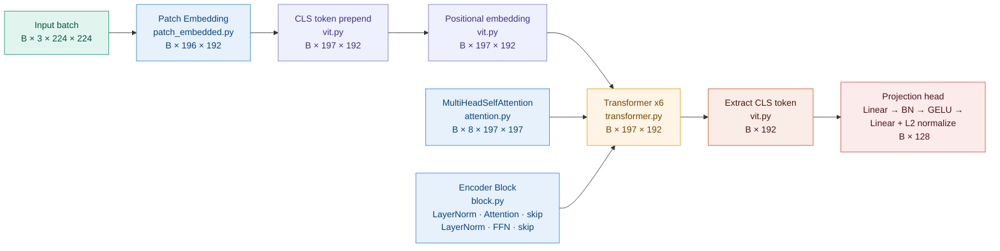
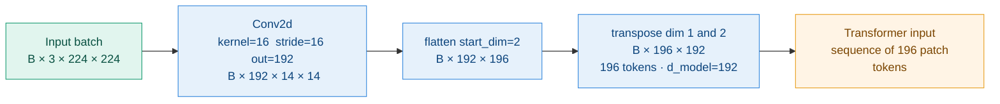
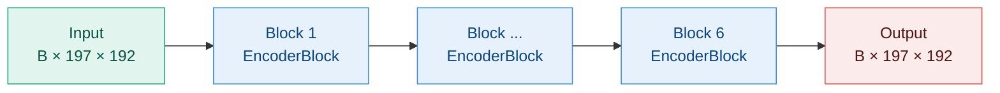
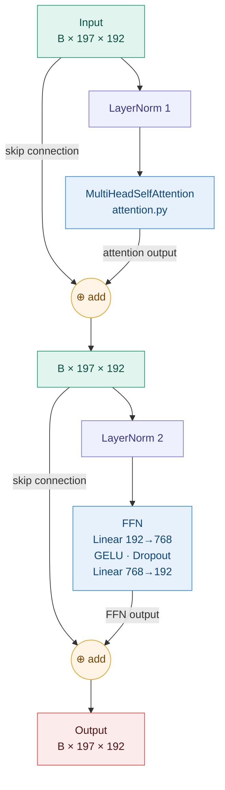

# Model

## Overview

The model is a Vision Transformer (ViT-Tiny) that maps each input image to a
128-dimensional L2-normalized embedding vector. Same vehicle images produce
close vectors; different vehicle images produce distant vectors. Retrieval is
then a nearest-neighbor search in this embedding space.

$$f : \text{image} \rightarrow \mathbb{R}^{128}, \quad \|f(x)\| = 1$$

| File | Role |
|---|---|
| `model/patch_embedded.py` | Splits each image into 196 patch tokens of dimension 192 |
| `model/vit.py` | CLS token, positional embedding, projection head — orchestrates the full forward pass |
| `model/transformer.py` | Stack of 6 encoder blocks |
| `model/block.py` | One encoder block: LayerNorm + Attention + skip + LayerNorm + FFN + skip |
| `model/attention.py` | Multi-head self-attention mechanism |
| `model/init_model.py` | Instantiates and initializes the final model |



---

## Patch Embedding — `model/patch_embedded.py`

### Theory

A Transformer expects a sequence of vectors as input.
An image is a 2D grid — not a sequence. Patch embedding converts it.

The image is split into $N$ non-overlapping patches of size $P \times P$:

$$N = \frac{H \times W}{P^2} = \frac{224 \times 224}{16^2} = 196 \text{ tokens}$$

Each patch covers $P \times P = 16 \times 16$ pixels across 3 RGB channels = 768 raw values.
A linear projection maps those 768 values to $d_{\text{model}} = 192$ — the working
dimension of the Transformer throughout the entire network.

A single `Conv2d(kernel=P, stride=P)` performs both operations in one GPU pass:
- `kernel=16` covers exactly one patch
- `stride=16` moves by exactly one patch — no overlap, no gap
- `out_channels=192` is the linear projection learned during training

### Tensor flow

```
Input batch        :  (B,   3, 224, 224)
Conv2d k=16 s=16   :  (B, 192,  14,  14)   ← 196 patch positions on a 14×14 grid
flatten(start=2)   :  (B, 192, 196)         ← spatial grid → flat sequence
transpose(1, 2)    :  (B, 196, 192)         ← (batch, seq_len, d_model)
```

### Parameters

| Parameter | Value | Derived from |
|---|---|---|
| `img_size` | 224 | ImageNet convention |
| `patch_size` | 16 | attention is O(N²) — patch=8 would 4× memory |
| `in_channels` | 3 | RGB |
| `d_model` | 192 | ViT-Tiny standard width |
| `num_patches` | 196 | $(224/16)^2 = 14^2 = 196$ |
| Conv2d weights | $3 \times 16 \times 16 \times 192 = 147\,456$ | learned projection |

#### Diagram


---

## CLS Token + Positional Embedding — `model/vit.py`

### CLS token

The CLS token is a learnable vector (`nn.Parameter`, shape `1×192`) prepended
to the patch sequence before the Transformer. It has no spatial meaning — it is
a dedicated slot that aggregates information from all other tokens through
attention across all 6 Transformer layers.

```
Before Transformer :  [CLS,  p1,  p2, ..., p196]   →  197 × 192
After  Transformer :  [CLS', p1', p2', ..., p196']  →  197 × 192
                        ↑
                   only this token is extracted
```

At forward time, the stored CLS token `(1, 1, 192)` is expanded to `(B, 1, 192)`
and prepended along the sequence dimension — producing 197 tokens.

### Positional embedding

Self-attention is permutation-invariant — it only depends on dot products between
token vectors, not their order. Without positional information the Transformer
treats every patch position identically.

The positional embedding is an `nn.Parameter` of shape `1×197×192` added
element-wise to the full sequence including the CLS token:

$$x_i \leftarrow x_i + e_i^{pos} \quad \forall i \in \{0, 1, \ldots, 196\}$$

Stored with batch dimension 1 — PyTorch broadcasting applies it to every image.

### Initialization

Both parameters are initialized with `trunc_normal(std=0.02)` — small values
keep activations stable and prevent exploding signals through residual connections.

### Key operations

| Step | Operation | Input shape | Output shape |
|---|---|---|---|
| Expand CLS | expand to batch size | `1 × 1 × 192` | `B × 1 × 192` |
| Prepend CLS | concatenate on sequence dim | `B × 196 × 192` | `B × 197 × 192` |
| Add pos embed | element-wise addition | `B × 197 × 192` | `B × 197 × 192` |

| Parameter | Shape | Init |
|---|---|---|
| `cls_token` | `1 × 1 × 192` | `trunc_normal std=0.02` |
| `pos_embed` | `1 × 197 × 192` | `trunc_normal std=0.02` |

### Dropout

`Dropout(p=0.1)` is applied to the token sequence immediately after the positional
embedding addition. It randomly zeros 10% of activations during training, preventing
the model from over-relying on specific token positions. Disabled automatically at
`model.eval()`. Also applied inside each encoder block — in the FFN and on attention weights.

---

## Transformer Encoder — `model/transformer.py`
 
All the complexity lives in `block.py`. `transformer.py` has a single responsibility:
instantiate 6 independent `EncoderBlock` instances and apply them sequentially.
 
**Why 6 blocks ?**
Each block refines the token representations over increasingly abstract features.
Early blocks capture low-level spatial relations between patches. Later blocks
build identity-level representations. 6 is the standard depth for ViT-Tiny —
deep enough to learn complex vehicle features, shallow enough to train from scratch
on 52k images without overfitting.
 
The forward pass is a simple sequential loop — the output of block $i$ is the
input of block $i+1$, and the sequence shape `(B, 197, 192)` never changes:
 

 
---

## Multi-Head Self-Attention — `model/attention.py`
 
### What attention solves
 
After patch embedding, each token contains only local information — what it saw
in its own 16×16 region. A patch covering the rear wheel knows nothing about the
front bumper, the logo, or the license plate.
 
Attention allows every token to **communicate with every other token** and update
its representation based on what it learns. After one attention layer, the rear
wheel token has aggregated information from the logo, the body lines, and the
bumper — all in one operation.
 
---
 
### The three roles — Q, K, V
 
Each token simultaneously plays three roles, derived from three independent
learned projections of the same input vector:
 
$$\mathbf{Q} = \mathbf{X}\mathbf{W}^Q, \quad \mathbf{K} = \mathbf{X}\mathbf{W}^K, \quad \mathbf{V} = \mathbf{X}\mathbf{W}^V$$
 
| Symbol | Role | Intuition |
|---|---|---|
| $\mathbf{Q}$ — Query | what this token is looking for | *"what do I need to understand myself better?"* |
| $\mathbf{K}$ — Key | how this token presents itself to others | *"what can I offer to those who ask?"* |
| $\mathbf{V}$ — Value | what this token actually transmits if chosen | *"the actual information I pass along"* |
 
On a vehicle image:
```
patch_wheel (192-d)
    × W_Q  →  Q  "looking for: other wheels, body symmetry"
    × W_K  →  K  "advertising: I am a circular dark region"
    × W_V  →  V  "transmitting: wheel shape, position, size"
```
 
The three weight matrices are learned independently — this freedom to separate
the three roles is what gives attention its expressive power.
 
---
 
### Scaled dot-product attention
 
For all 197 tokens at once, the attention output is:
 
$$\text{attention}(\mathbf{Q}, \mathbf{K}, \mathbf{V}) = \text{softmax}\left(\frac{\mathbf{Q}\mathbf{K}^T}{\sqrt{d_k}}\right)\mathbf{V}$$
 
**1. Similarity matrix** — $\mathbf{Q}\mathbf{K}^T \in \mathbb{R}^{197 \times 197}$
 
Each entry $(i, j)$ is the dot product between token $i$'s query and token $j$'s key.
The dot product is an unnormalized cosine similarity — it measures the alignment
between two vectors:
 
$$\mathbf{q}^T\mathbf{k} = \|\mathbf{q}\| \cdot \|\mathbf{k}\| \cdot \cos\theta$$
 
```
          CLS   p_wheel  p_sky   p_hood ...
CLS      [ 0.8    0.6     0.1     0.7  ...]   ← CLS attends to discriminative regions
p_wheel  [ 0.2    0.9     0.0     0.1  ...]   ← wheel attends to the other wheel
p_sky    [ 0.1    0.0     0.8     0.0  ...]   ← sky attends only to itself
```
 
**2. Softmax → attention matrix A**
 
Each row is converted to a probability distribution summing to 1:
 
```
          CLS   p_wheel  p_sky   p_hood ...
CLS      [0.35   0.25    0.01    0.28  ...]   ← sums to 1.0
p_wheel  [0.08   0.60    0.00    0.05  ...]   ← sums to 1.0
```
 
**3. Weighted sum of Values** — $\mathbf{A}\mathbf{V}$
 
Each output token is a weighted average of all value vectors:
 
$$\text{output}_{\text{CLS}} = 0.35 \cdot \mathbf{V}_{\text{CLS}} + 0.25 \cdot \mathbf{V}_{\text{wheel}} + 0.01 \cdot \mathbf{V}_{\text{sky}} + 0.28 \cdot \mathbf{V}_{\text{hood}} + \ldots$$
 
The CLS token aggregates discriminative vehicle features weighted by their
relevance. After 6 Transformer layers, it has accumulated a rich identity
representation across the entire image.
 
---
 
### Multi-head attention
 
A single attention head learns one type of similarity relation. With $h = 8$
parallel heads, each operating in a distinct 24-dimensional subspace, the model
can simultaneously learn multiple types of relations:
 
$$\text{multihead}(\mathbf{Q}, \mathbf{K}, \mathbf{V}) = \text{concat}(\mathbf{H}_1, \ldots, \mathbf{H}_8)\mathbf{W}^O$$
 
$$\mathbf{H}_i = \text{attention}(\mathbf{Q}\mathbf{W}^Q_i,\ \mathbf{K}\mathbf{W}^K_i,\ \mathbf{V}\mathbf{W}^V_i)$$
 
with $\mathbf{W}^Q_i, \mathbf{W}^K_i \in \mathbb{R}^{192 \times 24}$, $\mathbf{W}^V_i \in \mathbb{R}^{192 \times 24}$, $\mathbf{W}^O \in \mathbb{R}^{192 \times 192}$.
 
```
head 1 → color similarity        (two red patches attend to each other)
head 2 → texture patterns        (wheel ↔ wheel on the other side)
head 3 → spatial relationships   (hood ↔ badge in the center)
head 4 → edges and contours      (vehicle boundary regions)
...
```
 
Each head projects Q, K, V to $d_k = 24$ dimensions, computes attention
independently, then the 8 outputs are concatenated back to 192 dimensions and
mixed by the final projection $\mathbf{W}^O$:
 
```
X      : (B, 197, 192)   input sequence
 
reshape: (B, 8, 197, 24)   split into 8 heads
 
per head:
  Q_i  : (B, 8, 197, 24)
  K_i  : (B, 8, 197, 24)
  V_i  : (B, 8, 197, 24)
  A_i  = softmax(Q_i @ K_i.T / √24)   : (B, 8, 197, 197)
  H_i  = A_i @ V_i                    : (B, 8, 197, 24)
 
concat : (B, 197, 192)   8 × 24 = 192
× W_O  : (B, 197, 192)   same shape as input
```
 
The output has the same shape as the input — each token has been enriched by
information from all other tokens according to 8 distinct learned relations.
 
---
 
### Self-attention in the ViT context
 
In your ViT, $\mathbf{X} = \mathbf{X'}$ — queries, keys and values are all
derived from the same sequence. This is **self-attention**: each token can attend
to any other token in the same sequence, including itself.
 
This is what makes the ViT fundamentally different from a CNN:
a convolutional layer can only look at a local neighborhood defined by the kernel
size. Self-attention has **global receptive field from the very first layer** —
the rear wheel patch can directly influence the front bumper patch without
going through intermediate layers.
 
---
 
### Parameters
 
| Tensor | Shape | Role |
|---|---|---|
| $\mathbf{W}^{QKV}$ (fused) | `3 × d_model × d_model` = `3 × 192 × 192` | Projects X to Q, K, V in one operation |
| $\mathbf{W}^O$ | `192 × 192` | Mixes the 8 concatenated head outputs |
| Attention dropout | `p=0.1` | Applied to scores A after softmax |
 
> In practice the three projections $\mathbf{W}^Q$, $\mathbf{W}^K$, $\mathbf{W}^V$
> are fused into a single `nn.Linear(d_model, 3 * d_model)` and split afterward —
> one GPU call instead of three, with identical mathematical result.
 
---
# Encoder Block — `model/block.py`

## What the block does

After the CLS token and positional embedding are added, the sequence `(B, 197, 192)`
enters a stack of 6 identical encoder blocks. Each block takes the full sequence,
lets every token communicate with every other via attention, then refines each
token independently via a feedforward network.

The output is the same shape `(B, 197, 192)` — the sequence is enriched, not transformed.

---

## The two sub-modules

Each encoder block applies **two sub-modules in sequence**, each wrapped in a
skip connection and preceded by a LayerNorm. This is the **Pre-Norm** variant
used in modern ViTs (lec7 page 39):

$$\mathbf{X}' = \mathbf{X} + \text{Attention}(\text{LayerNorm}(\mathbf{X}))$$

$$\mathbf{X}'' = \mathbf{X}' + \text{FFN}(\text{LayerNorm}(\mathbf{X}'))$$

The original paper (Vaswani et al., 2017) applied LayerNorm **after** the sub-module
(Post-Norm). Modern implementations apply it **before** (Pre-Norm) — it stabilizes
gradients during early training when weights are still random.

---

## Skip connections — why they matter

The `+` in the formula is not just addition. It creates a **gradient highway**
directly from the loss back to the early layers, bypassing the sub-module entirely.

Without skip connections, gradients must flow through all 6 blocks and all the
non-linearities inside each sub-module. They vanish before reaching the early layers
and training stalls.

With skip connections, even if the sub-module learns nothing useful, the input
passes through unchanged. The model degrades gracefully rather than breaking.

On vehicle images, this means that if a block cannot find useful cross-patch
relationships for a particular identity, the representations from the previous
block are preserved intact.

---

## LayerNorm — why per token

LayerNorm normalizes the 192 features of **each token independently**:

$$\text{LayerNorm}(\mathbf{u}) = \gamma \odot \frac{\mathbf{u} - \mu}{\sigma} + \beta$$

where $\mu$ and $\sigma$ are computed over the 192 features of a single token,
not over the batch. $\gamma$ and $\beta$ are learned scale and shift parameters.

This is different from BatchNorm which normalizes across the batch dimension.
LayerNorm is preferred in Transformers because the sequence length varies and
the batch statistics are unreliable for sequential data.

On your 197 tokens: each token's 192 values are independently centered and scaled
before being fed to the attention or FFN sub-module. This keeps the input
distribution stable regardless of what the previous layer produced.

---

## FFN — feedforward network

The FFN is a two-layer MLP applied **independently to each token**:

$$\text{FFN}(\mathbf{x}) = \text{Linear}_{2}(\text{Dropout}(\text{GELU}(\text{Linear}_{1}(\mathbf{x}))))$$

| Layer | Shape | Role |
|---|---|---|
| `Linear(192 → 768)` | expands by `mlp_ratio=4` | projects to a richer feature space |
| `GELU` | — | smooth non-linearity |
| `Dropout(p=0.1)` | — | stochastic regularization |
| `Linear(768 → 192)` | compresses back | projects back to d_model |

**Why expand then compress ?**
The expansion to 768 dimensions gives the network capacity to represent complex
non-linear combinations of the 192 attention features. The compression back to 192
forces it to distill only the relevant information.

**Why GELU instead of ReLU ?**
GELU (Gaussian Error Linear Unit) is a smooth approximation of ReLU — it does not
hard-zero negative inputs but attenuates them softly. This produces smoother gradients
and consistently outperforms ReLU on Transformer architectures.

**Why applied independently to each token ?**
The FFN operates on one token at a time — it does not mix information across tokens.
Cross-token communication happens exclusively in the attention sub-module. The FFN
refines each token's representation in its own feature space after it has been
enriched by attention.

On your vehicle patches: after attention has let the wheel token gather information
from the logo and the hood, the FFN processes the wheel token's updated representation
independently to extract higher-level features.

---
This block is repeated 6 times in `transformer.py`. Each repetition allows tokens
to attend over increasingly abstract representations of the vehicle.

## Parameters per block

| Component | Parameters | Shape |
|---|---|---|
| LayerNorm 1 | γ, β | `192 × 2` |
| MultiHeadSelfAttention | qkv + W_O | `4 × 192 × 192` |
| LayerNorm 2 | γ, β | `192 × 2` |
| FFN Linear 1 | W, b | `192 × 768` |
| FFN Linear 2 | W, b | `768 × 192` |

Total per block ≈ **295 000 parameters** × 6 blocks ≈ **1.77M parameters** for the
full Transformer stack.

---

## Diagram



---

## Reference

lec7 page 39 — Residual connections and layer normalization.

$$\mathbf{X}' = \mathbf{X} + \text{SubModule}(\text{LayerNorm}(\mathbf{X})) \quad \text{(Pre-Norm, modern)}$$

$$\mathbf{X}' = \text{LayerNorm}(\mathbf{X} + \text{SubModule}(\mathbf{X})) \quad \text{(Post-Norm, original paper)}$$

## Projection Head — `model/vit.py`

After the Transformer, the CLS token at position 0 is extracted `(B, 192)`.
It passes through a final LayerNorm, a two-layer projection head, and L2 normalization:

```
CLS token   :  (B, 192)
LayerNorm   :  (B, 192)   ← stabilizes input to projection
Linear      :  (B, 192)   ← 192 → 192, first projection
BatchNorm   :  (B, 192)   ← prevents representation collapse
GELU        :  (B, 192)   ← non-linearity
Linear      :  (B, 128)   ← 192 → 128, final projection
L2 norm     :  (B, 128)   ← projects onto unit hypersphere
```

**Why a two-layer head with BatchNorm ?**
A single linear projection is prone to representation collapse — all embeddings
converge to the same point on the hypersphere. The BatchNorm layer forces the
activations to maintain non-zero variance before the final projection, preventing
this degenerate solution. This was the critical fix that enabled stable training
from scratch without pretrained weights.

**Why 128 dimensions ?**
Compact enough for fast nearest-neighbor retrieval at inference — the distance matrix
`40 × 52677` (local eval) is computed in one matrix multiplication. Expressive
enough to separate 440 vehicle identities on the unit hypersphere.

**Why L2 normalization ?**
After normalization all vectors lie on the unit hypersphere: $\|f(x)\| = 1$.
Cosine distance becomes equivalent to Euclidean distance, which is what the
triplet loss minimizes. The embedding space has well-defined geometry.
