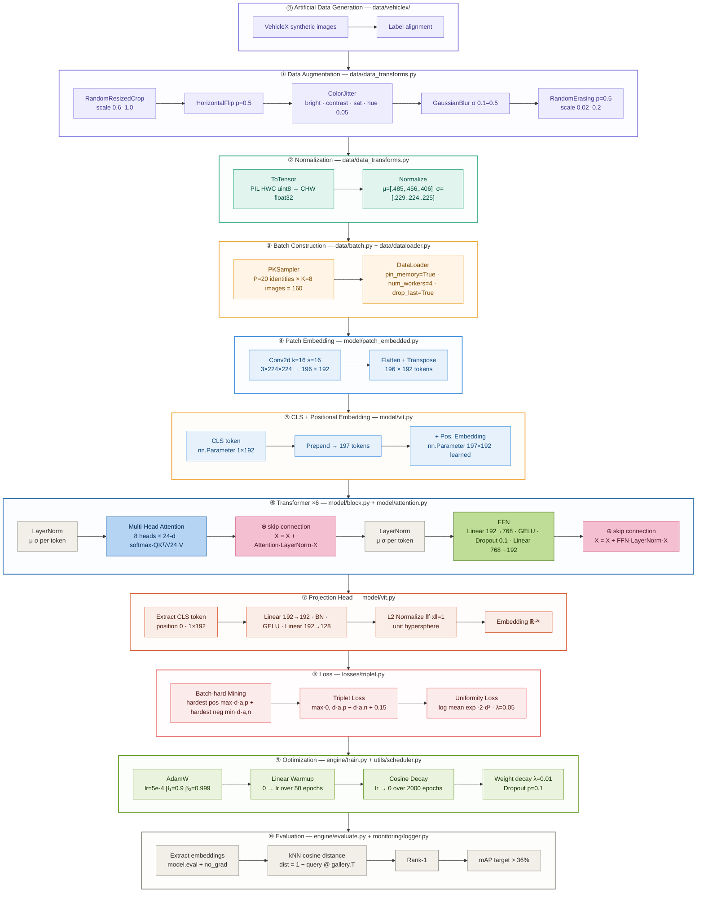

<div align="center">

# Vehicle Re-Identification - ViT from Scratch

*INFO8010 · Deep Learning · ULiège 2025-2026*

**Antoine Deckers** (s170999) · **Florent Volvert** (s203710)

</div>

---

## Goal

Match the same vehicle across a city-scale camera network - **Track 2 of the 2021 NVIDIA AI City Challenge**. Given a query image, retrieve all images of the same vehicle in a gallery of images taken by *other* cameras.

Since new vehicles appear at test time, we do not classify - we learn an embedding function

<div align="center">

*f* : image $\rightarrow$ ℝ¹²⁸

</div>

such that same vehicle $\rightarrow$ close vectors, different vehicles $\rightarrow$ distant vectors. Retrieval is then a nearest-neighbor search.

## Dataset — AIC21 Track 2 ReID

The project uses the **AI City Challenge 2021 Track 2** benchmark for city-scale vehicle re-identification.
The dataset contains **85 058 cropped vehicle images** across **440 real identities** (+ 1362 synthetic via VehicleX), captured by **46 non-overlapping cameras** in real traffic conditions.
A subset of images is synthetically generated via [VehicleX](https://github.com/yorkeyao/VehicleX) (3D-rendered vehicles) and **optionally** merged into the training set to compensate for the limited real data.

---

#### Dataset splits

| Split | Folder | Images | Identities | Role |
|---|---|---|---|---|
| Training | `image_train/` | 52 717 | 440 | Model training (+ VehicleX synthetic) |
| Gallery | `image_test/` | 31 238 | 440 | Retrieval target at evaluation |
| Query | `image_query/` | 1 103 | 440 | Images to match against the gallery |

> Training and test identities are **disjoint** — the model never sees test vehicles during training.
> This forces genuine metric learning rather than memorization.

---

### Annotation files
 
| File | Content | Used by |
|---|---|---|
| `train_label.xml` | `vehicleID` + `cameraID` per training image. The only file with both labels — `vehicleID` drives PK batch construction, `cameraID` filters same-camera pairs at evaluation | `dataset.py → _parse_xml()` |
| `test_label.xml` | `cameraID` per gallery image. No `vehicleID` by design — it is the ground truth the model must predict; providing it would be data leakage | Evaluation protocol |
| `query_label.xml` | `cameraID` per query image. Same rationale as `test_label.xml` | Evaluation protocol |
| `train_track.txt` | Each line lists all images of the same vehicle on the same camera in temporal order. Enables Query Expansion: averaging track embeddings produces a more robust query vector than a single image (technique used by 2021 winners, optional for MVP) | Query expansion (Optional) |
| `test_track.txt` | Same structure as `train_track.txt` for the gallery split | Query expansion (Optional) |
| `name_train.txt` | Plain list of the 52 717 filenames in `image_train/` | Sanity check |
| `name_test.txt` | Plain list of the 31 238 filenames in `image_test/` | Sanity check |
| `name_query.txt` | Plain list of the 1 103 filenames in `image_query/` | Sanity check |
 
> A retrieved gallery image is counted as a true positive only when it shows the same vehicle on a **different** camera.
> Same vehicle, same camera = ignored. This enforces genuine cross-camera retrieval.

**Why `cameraID` matters at evaluation:**
a match is only counted as a true positive when the retrieved image shows the **same vehicle on a different camera**.
Same vehicle + same camera = ignored. This enforces cross-camera retrieval.

#### XML format (`train_label.xml`)
```xml
<TrainingImages Version="1.0">
  <Items number="52717">
    <Item imageName="000001.jpg" vehicleID="001" cameraID="c036"/>
    <Item imageName="000002.jpg" vehicleID="001" cameraID="c043"/>
    ...
  </Items>
</TrainingImages>
```

---

#### Evaluation output format

For each query image, the model produces one `.txt` file listing gallery image IDs ranked by **ascending embedding distance**:

```
# 000001.txt  — results for image_query/000001.jpg
5021          ← closest gallery image  (image_test/005021.jpg)
12701
19500
13169
...           ← top-50 matches
```

The evaluation script reads these files and computes **Rank-1 accuracy** and **mAP** against the ground-truth labels.
An example of the expected format is provided in `tools/dist_example/`.

---

#### Two-dataset merge strategy


> **Key rule:** the synthetic dataset is used **only for training**.
> The gallery (`image_test/`) and queries (`image_query/`) are always real images exclusively.

---

#### Visualization tool

`tools/visualize.py` is a Tkinter GUI that renders the retrieval results visually.
It reads the `.txt` files from a results directory and displays the query image alongside its top-50 gallery matches.

> ⚠️ The script is written in **Python 2** — port to Python 3 before use (`Tkinter` → `tkinter`, `print` statements, etc.).

---

## Pipeline

### 1. Artificial data generation — `data/vehiclex/`
   - 1.1. **VehicleX synthetic images** — 3D-rendered cropped vehicles with controlled viewpoints, lighting and backgrounds added to the training set
   - 1.2. **Label alignment** — synthetic images are assigned real vehicle identities and camera IDs compatible with `train_label.xml`
### 2. Data augmentation — `data/data_transforms.py`
   - 2.1. **RandomResizedCrop** `scale=(0.6, 1.0)` — simulates imperfect detection crops
   - 2.2. **HorizontalFlip** `p=0.5` — lateral symmetry of vehicles; no vertical flip (invalid viewpoint)
   - 2.3. **ColorJitter** `brightness · contrast · saturation` — cross-camera lighting variance; hue kept minimal to preserve vehicle color identity
   - 2.4. **GaussianBlur** `σ ∈ [0.1, 0.5]` — low-quality or motion-blurred cameras
   - 2.5. **RandomErasing** `p=0.5, scale=(0.02, 0.2)` — occlusion simulation (poles, other vehicles); forces global representation
### 3. Normalization — `data/data_transforms.py`
 
- **ToTensor** — converts a raw PIL image into a PyTorch tensor.
  Pixels go from integers in [0, 255] to floats in [0, 1],
  and dimensions are reordered so channels come first —
  the format PyTorch expects.
- **Normalize** — recenters each color channel around zero
  using the mean and standard deviation of ImageNet.
  Without this, brighter channels dominate the gradients
  and training becomes unstable. After normalization,
  all channels contribute equally to learning.
### 4. Batch construction — `data/batch.py` + `data/dataloader.py`
 
- **4.1. PK sampling** `P=20 identities × K=8 images = batch of 160` — PKSampler builds each batch with exactly P identities and K images each. Standard random shuffle cannot guarantee positives in a batch — batch-hard triplet loss requires at least one positive per anchor. With P=20 and K=8, each anchor has **7 positives** and **152 negatives** available for hard mining.
- **4.2. DataLoader** — delivers batches to the model; `pin_memory=True` accelerates CPU → GPU transfer; `num_workers=4` parallelizes image loading so the GPU never waits for data; `drop_last=True` ensures every batch has exactly P×K images — an incomplete last batch would break the triplet loss structure.
### 5. Patch embedding — `model/patch_embedded.py`
 
- **5.1. Conv2d** `kernel=16, stride=16, out=192` — splits 3×224×224 into 196 non-overlapping patches of 16×16 pixels, and linearly projects each 768-value patch to a 192-d vector in one GPU operation. The stride=16 guarantees no overlap and no gap between patches.
- **5.2. Flatten + Transpose** — reshapes 192×14×14 → sequence of **196 × 192** tokens. The spatial grid becomes a flat sequence — the format the Transformer expects.
### 6. CLS token + positional embedding — `model/vit.py`
 
- **6.1. CLS token** `nn.Parameter(1×192)` — a learnable vector with no spatial meaning, prepended to the 196 patch tokens → sequence becomes **197 × 192**. It aggregates the full image representation through attention across all 6 Transformer layers. Only this token is extracted after the Transformer.
- **6.2. Learned positional embedding** `nn.Parameter(197×192)` — added element-wise to the full sequence. Self-attention is permutation-invariant — without this, the Transformer cannot distinguish the top-left patch from the bottom-right patch. One position vector per token, learned during training.

### 7. Transformer Encoder ×6 — `model/block.py` + `model/attention.py`
 
Each block applies two operations, each protected by a skip connection.
 
**LayerNorm** — before each operation, every token is independently
normalized to zero mean and unit variance. This stabilizes activations
without depending on other images in the batch.
 
**Multi-Head Self-Attention** — each token looks at every other token
and decides which ones matter. Three projections are computed per token
(Query, Key, Value) and attention scores determine how much each token
borrows from the others. Running 8 heads in parallel lets the model
simultaneously track different relationships — shape, color, position.
 
**Skip connection** — the input is added back to the output of each
sub-module. This creates a gradient highway through all 6 blocks,
preventing vanishing gradients during backpropagation.
 
**FFN** — after attention mixes information across tokens, the FFN
processes each token independently through a 4× expansion
(192 → 768 → 192) with GELU activation, adding non-linear
transformation capacity.

### 8. Projection Head — `model/vit.py`
 
- **8.1. Extract CLS token** — after the Transformer, only position 0
  of the output sequence is kept. The CLS token has aggregated the full
  image representation through 6 layers of attention.
  The 196 patch tokens are discarded.
- **8.2. Projection** `Linear(192→192) → BatchNorm → GELU → Linear(192→128)`
  — a two-layer head that compresses the representation into a 128-dimensional
  embedding. The BatchNorm layer is critical — it prevents representation
  collapse by forcing activations to maintain non-zero variance.
- **8.3. L2 normalize** `‖f(x)‖ = 1` — every embedding vector is projected
  onto the unit hypersphere. This makes cosine similarity equivalent to
  euclidean distance, simplifying both the triplet loss and the
  nearest-neighbor search at evaluation time.

### 9. Loss — `losses/tripletloss.py`
 
- **9.1. Batch-Hard Mining** — for each image in the batch (the *anchor*),
  the hardest triplet is selected:
  - **hardest positive** `max d(a,p)` — the image of the *same* vehicle
    that is *farthest* from the anchor in embedding space.
    This is the most challenging same-identity pair to pull together.
  - **hardest negative** `min d(a,n)` — the image of a *different* vehicle
    that is *closest* to the anchor. This is the most dangerous
    confusion the model could make.
  Focusing on hard pairs forces the model to fix its worst mistakes
  at every step, rather than wasting gradient on easy pairs it
  already handles correctly.
- **9.2. Triplet Loss** `max(0, d(a,p) − d(a,n) + margin)` — the loss
  is zero when the negative is already farther than the positive by
  at least `margin=0.15`. Only violated triplets produce a gradient.
  The **margin** acts as a safety buffer: the model is not just asked
  to rank positives before negatives — it must keep them separated
  by a minimum distance. A tighter margin is easier to satisfy;
  too large and the model collapses trying to enforce an impossible gap.
- **9.3. Uniformity Loss** `log mean exp(-2‖zi − zj‖²)` — a regularization
  term that penalizes embeddings clustering together on the hypersphere.
  Without it, the model finds a degenerate solution: mapping everything
  to the same point satisfies the triplet loss trivially (all distances
  are zero, all margins are satisfied). The uniformity loss acts as a
  repulsive force pushing all embeddings apart, regardless of identity.
- **9.4. Combined objective** `L = L_triplet + λ · L_unif` with `λ = 0.05`
  — the triplet loss pulls same-identity embeddings together and pushes
  different ones apart; the uniformity loss ensures the full hypersphere
  is used rather than collapsing into a small cluster.
### 10. Optimisation — `engine/train.py` + `utils/schedular.py`
 
- **10.1. AdamW** `lr=5e-4, β₁=0.9, β₂=0.999` — adaptive optimiser that
  maintains a separate learning rate for each model parameter. `β₁=0.9`
  means the gradient direction is smoothed over ~10 past steps; `β₂=0.999`
  means the gradient magnitude is tracked over ~1000 steps — this combination
  is the standard ViT default from the original paper. The **W** stands for
  decoupled weight decay, making it more effective than vanilla Adam for
  regularisation. `lr=5e-4` was chosen as the peak learning rate — higher
  values caused training instability, lower values slowed convergence
  without improving final performance.
- **10.2. Linear Warmup** — the learning rate starts near zero and rises
  linearly to `5e-4` over the first 50 epochs. At the start of training,
  weights are random and gradients are chaotic — a large LR would cause
  destructive updates. 50 epochs was chosen because the model needs more
  warmup time at `lr=5e-4` than at the standard `1e-4` — the higher peak
  requires a longer stabilisation phase.
- **10.3. Cosine Decay** — after warmup, the LR follows a cosine curve
  down to zero over the remaining 1950 epochs. Unlike step or linear decay,
  the cosine schedule decreases slowly at first and gently at the end —
  the model keeps exploring in mid-training, then converges smoothly
  without oscillations. This is the standard schedule for ViT training.
- **10.4. Weight Decay** `λ=0.01` — penalises large weights by adding
  `λ‖θ‖²` to the loss. `0.01` is the standard AdamW default — strong
  enough to prevent overfitting on the 52k training images, mild enough
  not to over-constrain the model's capacity to learn vehicle features.
- **10.5. Dropout** `p=0.1` — during training, 10% of neurons are randomly
  zeroed at each forward pass. `p=0.1` is deliberately light — heavier
  dropout would slow convergence on a model already training from scratch
  without pretrained weights. Disabled at evaluation.
### 11. Evaluation — `engine/evaluate.py` + `monitoring/logger.py`
 
- **11.1. Extract embeddings** — the model switches to evaluation mode
  (`model.eval()`) which disables dropout for deterministic embeddings.
  `torch.no_grad()` disables gradient computation — unnecessary at
  inference, this halves memory usage. No augmentation is applied:
  stable and reproducible embeddings are required for reliable ranking.
- **11.2. kNN search** — for each query, a cosine distance is computed
  against all ~10 500 local gallery images via
  `dist = 1 − query_emb @ gallery_emb.T`. Since embeddings are
  L2-normalized, cosine distance is equivalent to euclidean distance.
  The gallery is then sorted by ascending distance —
  the most similar images appear at the top.
- **11.3. Rank-1** — measures whether the correct vehicle is retrieved
  at position 1. A query is considered correct if its top-1 result shows
  the same vehicle from a different camera. Simple and intuitive, but
  does not capture the quality of the full ranking.
- **11.4. mAP** — measures the quality of the full ranking for each query.
  For each query, Average Precision computes precision at each retrieved
  true positive among valid (non-junk) positions only, then averages these
  values. mAP is the mean over all 88 queries. A model that retrieves all
  true positives at the top of the list achieves mAP=1. This is the primary
  challenge metric — stricter than Rank-1 as it penalises true positives
  ranked too low.
  **Target: exceed the 36.0% val mAP baseline of the 2021 winners.**
---
## Why a Transformer and not a CNN?
 
The 2021 AI City Challenge winners relied on CNN-based architectures —
primarily ResNet-50 pretrained on ImageNet — combined with re-ranking
post-processing. Their strong results stemmed largely from the quality
of the pretrained backbone, not the architecture itself.
 
We deliberately chose a Vision Transformer for two reasons:
 
**Architectural motivation** — CNNs capture local features through
sliding filters: they are excellent at detecting edges, textures and
local patterns, but struggle to relate distant parts of an image without
many stacked layers. A transformer processes all 196 patches simultaneously
through self-attention — the front bumper can directly attend to the rear
lights in a single layer. For vehicle Re-ID, where identity cues are
spread across the whole image (shape, rims, spoilers, color distribution),
global context matters more than local texture.
 
**Scientific motivation** — the challenge was won in 2021 when transformers
were only beginning to emerge in computer vision. We revisit it five years
later to ask: can a modern attention-based architecture match CNN baselines
from that era, even when trained entirely from scratch without pretrained
weights? This controlled comparison isolates the architectural contribution
from the data advantage of pretraining.
 
The constraint of training from scratch is intentional — it shifts the
focus toward convergence mechanics, metric learning design, and
regularisation strategies rather than fine-tuning an already powerful backbone.
 ---

## Architecture default

| Parameter | Value | Why |
|---|---|---|
| Variant | ViT-Tiny | ~5M params · fits 52k training images without overfitting |
| Depth *L* | 6 | enough layers for global attention; shallow enough to train from scratch |
| Heads | 8 | 8 parallel attention subspaces; each specializes on a different visual relation |
| d<sub>model</sub> | 192 | standard Tiny width; divisible by 8 heads → 24-d per head |
| FFN hidden dim | 768 | 4 × d<sub>model</sub>; standard transformer ratio |
| Embedding dim | 128 | compact for fast nearest-neighbor retrieval at inference |
| Patch size | 16 | 196 tokens on 224² input; attention is O(N²), patch=8 would 4× memory |
| Input | 224 × 224 | ImageNet convention; compatible with normalization stats |
| Dropout | 0.1 | applied in FFN and attention weights; stochastic regularization |
| Positional emb. | Learned | nn.Parameter 197×192; better than sinusoidal for 2D image structure |
| Aggregation | CLS token | position 0 of output sequence; aggregates via attention across all layers |
| Init | trunc\_normal std=0.02 | keeps early activations small; avoids exploding signals through residuals |




## Monitoring

| Category | What to log | Why |
|---|---|---|
| **Loss** | `train_loss`, `val_loss` per epoch | detect overfitting (train down while val up) |
| **Retrieval** | `Rank-1`, `mAP` on val split | actual task metric — save best checkpoint on mAP |
| **Triplet health** | fraction of *active* triplets *(loss > 0)*, mean `d(a,p)` vs `d(a,n)` | if 0% active $\rightarrow$ nothing learns; gap should grow |
| **Gradients** | global grad norm + per-layer norm | catches vanishing / exploding gradients |
| **Optimizer** | current `lr` (warmup + cosine curve) | sanity-check schedule |
| **Weights** | mean / std of each block's params | detect dead neurons or drift |
| **Attention** | entropy of attention maps (optional) | high entropy = attention not focusing |
| **System** | GPU mem, throughput (img/s), epoch time | catch memory leaks, plan ablations |

## Target

Beat the **36.0% val mAP** cross-entropy baseline of the 2021 challenge winners.

> **Current best : run_007 — mAP ~80% · Rank-1 ~85%** on local validation split (88 held-out identities, 2000 epochs from scratch)

## Contributions

Every line of Python code in this repository was written by the group from scratch. No existing re-ID codebase was used as a starting point.

**Implemented from scratch:**

The full ViT-Tiny architecture was implemented independently: patch embedding via Conv2d(k=16, s=16), multi-head self-attention with fused QKV projection (8 heads × 24-d), Pre-Norm encoder blocks (LayerNorm → MHA → skip → LayerNorm → FFN → skip), and a projection head (Linear→BN→GELU→Linear→L2 norm, 192→128-d). The batch-hard triplet loss was implemented with a correct negative mask and extended with a uniformity regularisation term to prevent embedding collapse. The full training infrastructure was built from scratch: PKSampler (P=20 × K=8), AdamW with linear warmup and cosine decay, evaluation engine (kNN search, Rank-1, mAP), and a complete monitoring system (gradient health, triplet health, embedding distances, WandB integration). Unit tests cover dataset parsing, loss correctness, model forward pass, and end-to-end pipeline.

**With respect to the research question:**

We successfully train a ViT from scratch on a 2021 CNN-dominated benchmark, achieving mAP 66% and Rank-1 77.5% on an internal 80/20 validation split —-demonstrating that modern attention-based architectures trained without any pretrained weights can produce meaningfull results.  Seven training runs progressively improved projection head design, training length, and hyperparameters to reach this result.

**Reused or adapted:**

The AIC21 Track 2 dataset and its evaluation protocol were provided by the NVIDIA AI City Challenge organisers. The batch-hard mining strategy follows Hermans et al. (2017), the ViT-Tiny hyperparameters follow Dosovitskiy et al. (2020), and the uniformity loss follows Wang et al. (2020), all three were used as conceptual references only, with code written independently.

---

<sub>References: [AI City Challenge](https://www.aicitychallenge.org/2021-challenge-tracks/) · [VehicleX](https://github.com/yorkeyao/VehicleX) · [2021 winners (DMT)](https://github.com/michuanhaohao/AICITY2021_Track2_DMT) · [DINOv3](https://arxiv.org/abs/2508.10104)</sub>
