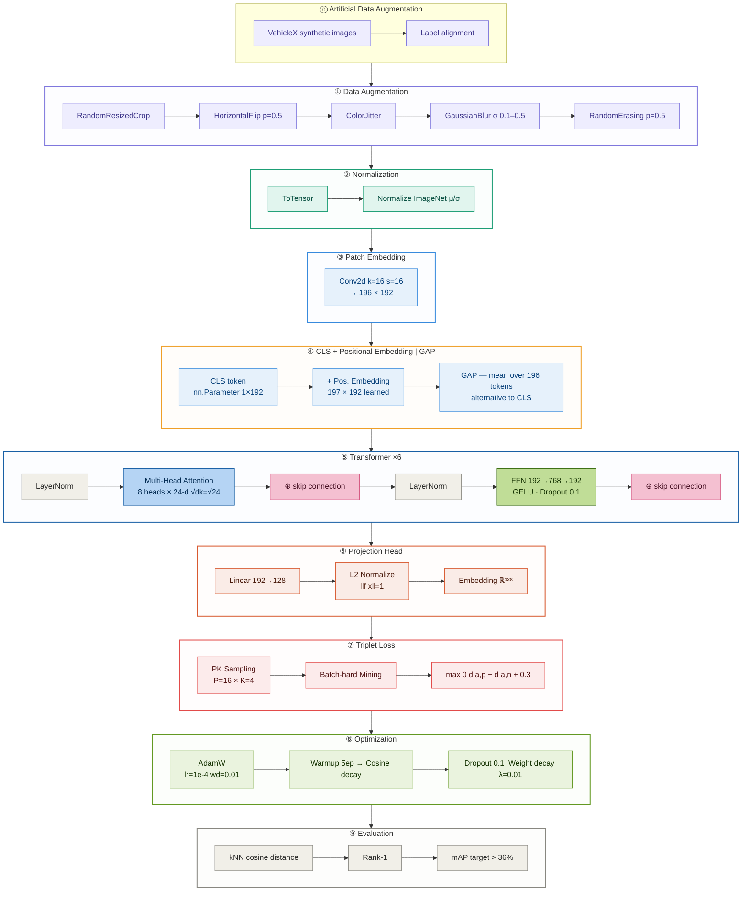

# Vehicle Re-Identification - ViT from Scratch

*INFO8010 · Deep Learning · ULiège 2025-2026*

**Antoine Deckers** (s170999) · **Florent Volvert** (s203710)

---

## Goal

Match the same vehicle across a city-scale camera network - **Track 2 of the 2021 NVIDIA AI City Challenge**. Given a query image, retrieve all images of the same vehicle in a gallery of images taken by *other* cameras.

Since new vehicles appear at test time, we do not classify - we learn an embedding function

*f* : image $\rightarrow$ ℝ¹²⁸

such that same vehicle $\rightarrow$ close vectors, different vehicles $\rightarrow$ distant vectors. Retrieval is then a nearest-neighbor search.

## Dataset

**AI City Challenge 2021 - Track 2.** 85 058 cropped images, 880 identities across non-overlapping cameras. Real + synthetic ([VehicleX](https://github.com/yorkeyao/VehicleX)).

---

## Pipeline

### 1. Artificial data generation — `data/vehiclex/`
   - 1.1. **VehicleX synthetic images** — 3D-rendered cropped vehicles with controlled viewpoints, lighting and backgrounds added to the training set
   - 1.2. **Label alignment** — synthetic images are assigned real vehicle identities and camera IDs compatible with `train_label.xml`

### 2. Data augmentation — `data/data_augmentation.py`
   - 2.1. **RandomResizedCrop** `scale=(0.6, 1.0)` — simulates imperfect detection crops
   - 2.2. **HorizontalFlip** `p=0.5` — lateral symmetry of vehicles; no vertical flip (invalid viewpoint)
   - 2.3. **ColorJitter** `brightness · contrast · saturation` — cross-camera lighting variance; hue kept minimal to preserve vehicle color identity
   - 2.4. **GaussianBlur** `σ ∈ [0.1, 0.5]` — low-quality or motion-blurred cameras
   - 2.5. **RandomErasing** `p=0.5, scale=(0.02, 0.2)` — occlusion simulation (poles, other vehicles); forces global representation

### 3. Normalization — `data/normalization.py`
   - 3.1. **ToTensor** — PIL HWC uint8 → PyTorch CHW float32 [0, 1]
   - 3.2. **Normalize** `μ=[0.485, 0.456, 0.406]  σ=[0.229, 0.224, 0.225]` — ImageNet stats; equal variance across channels stabilizes gradient descent

### 4. Patch embedding — `model/patch_embedded.py`
   - 4.1. **Conv2d** `kernel=16, stride=16, out=192` — splits 3×224×224 into 196 patches, projects each to 192-d in one operation
   - 4.2. **Flatten + Transpose** — reshapes 192×14×14 → sequence of **196 × 192** tokens

### 5. CLS token + positional embedding — `model/vit.py`
   - 5.1. **CLS token** `nn.Parameter(1×192)` — learnable vector prepended → sequence becomes **197 × 192**; aggregates image-level representation through attention
   - 5.2. **Learned positional embedding** `nn.Parameter(197×192)` — added element-wise; self-attention is permutation-invariant, position must be injected back
   - 5.3. **GAP (alternative)** — mean over 196 patch tokens; simpler aggregation, no CLS needed

### 6. Transformer encoder ×6 — `model/block.py` + `model/attention.py`

Each block applies two sub-modules, each wrapped in a **skip connection (+)**:

   - 6.1. **LayerNorm** — normalizes each token independently: `u' = γ⊙(u−μ)/σ + β`; μ, σ computed over 192 features of a single token (not the batch)
   - 6.2. **Multi-head self-attention** `8 heads × 24-d` — `Attention(Q,K,V) = softmax(QKᵀ / √24) · V`; each head learns a different relation (shape, color, position…)
   - 6.3. **Skip connection ⊕** — `X = X + Attention(LayerNorm(X))`; gradient highway, prevents vanishing
   - 6.4. **LayerNorm** — second normalization before FFN
   - 6.5. **FFN** — `Linear(192→768) → GELU → Dropout(0.1) → Linear(768→192)`; hidden dim = 4 × d_model; GELU smooth activation
   - 6.6. **Skip connection ⊕** — `X = X + FFN(LayerNorm(X))`

### 7. Projection head — `model/vit.py`
   - 7.1. **Extract CLS token** — take position 0 of the output sequence (1 × 192)
   - 7.2. **Linear** `192 → 128` — compact embedding for fast nearest-neighbor retrieval
   - 7.3. **L2 normalize** `‖f(x)‖ = 1` — projects onto unit hypersphere; cosine distance ≡ euclidean distance

### 8. Loss — `losses/triplet.py` + `data/batch.py`
   - 8.1. **PK sampling** `P=16 identities × K=4 images = 64` — guarantees positives and negatives in every batch
   - 8.2. **Batch-hard mining** — for each anchor: hardest positive `max d(a,p)` + hardest negative `min d(a,n)` within the batch
   - 8.3. **Triplet loss** `max(0, d(a,p) − d(a,n) + 0.3)` — margin=0.3 enforces a separation buffer; loss=0 → no gradient (monitor active triplet fraction)

### 9. Optimization — `engine/train.py` + `utils/scheduler.py`
   - 9.1. **AdamW** `lr=1e-4, β₁=0.9, β₂=0.999` — adaptive per-parameter learning rate; W = weight decay decoupled from gradient
   - 9.2. **Linear warmup** — lr: 0 → 1e-4 over 5 epochs; stabilizes early training when weights are random
   - 9.3. **Cosine decay** — lr smoothly decreases to 0 after warmup; avoids sharp drops
   - 9.4. **Weight decay** `λ=0.01` — penalty `λ‖θ‖²` discourages large weights, reduces overfitting
   - 9.5. **Dropout** `p=0.1` — applied in FFN and on attention weights; stochastic regularization

### 10. Evaluation — `engine/evaluate.py` + `monitoring/logger.py`
   - 10.1. **Extract embeddings** `model.eval() + no_grad()` — forward pass on all query and gallery images, no augmentation
   - 10.2. **kNN search** — cosine distance matrix: `dist = 1 − query_emb @ gallery_emb.T`; rank by ascending distance
   - 10.3. **Rank-1** — fraction of queries where top-1 retrieved image shares the same identity
   - 10.4. **mAP** — mean Average Precision; area under precision-recall curve averaged over all queries; **target > 36.0% val mAP**

## Architecture default

| Parameter | Value | Why |
|---|---|---|
| Variant | ViT-Tiny | ~5M params · fits 52k training images without overfitting |
| Depth *L* | 6 | enough layers for global attention; shallow enough to train from scratch |
| Heads | 8 | 8 parallel attention subspaces; each specializes on a different visual relation |
| dmodel | 192 | standard Tiny width; divisible by 8 heads → 24-d per head |
| FFN hidden dim | 768 | 4 × dmodel; standard transformer ratio |
| Embedding dim | 128 | compact for fast nearest-neighbor retrieval at inference |
| Patch size | 16 | 196 tokens on 224² input; attention is O(N²), patch=8 would 4× memory |
| Input | 224 × 224 | ImageNet convention; compatible with normalization stats |
| Dropout | 0.1 | applied in FFN and attention weights; stochastic regularization |
| Positional emb. | Learned | nn.Parameter 197×192; better than sinusoidal for 2D image structure |
| Aggregation | CLS token | position 0 of output sequence; aggregates via attention across all layers |
| Init | trunc\_normal std=0.02 | keeps early activations small; avoids exploding signals through residuals |

## Monitoring

| Category | What to log | Why |
|---|---|---|
| **Loss** | `train_loss`, `val_loss` per epoch | detect overfitting (train down while val up) |
| **Retrieval** | `Rank-1`, `mAP` on val split | actual task metric — save best checkpoint on mAP |
| **Triplet health** | fraction of *active* triplets *(loss > 0)*, mean `d(a,p)` vs `d(a,n)` | if 0% active $\rightarrow$ nothing learns; gap should grow |
| **Gradients** | global grad norm + per-layer norm | catches vanishing / exploding gradients |
| **Optimizer** | current `lr` (warmup + cosine curve) | sanity-check schedule |
| **Weights** | mean / std of each block's params | detect dead neurons or drift |
| **Attention** | entropy of attention maps (optional) | high entropy = attention not focusing |
| **System** | GPU mem, throughput (img/s), epoch time | catch memory leaks, plan ablations |

## Target

Beat the **36.0% val mAP** cross-entropy baseline of the 2021 challenge winners.

---

References: [AI City Challenge](https://www.aicitychallenge.org/2021-challenge-tracks/) · [VehicleX](https://github.com/yorkeyao/VehicleX) · [2021 winners (DMT)](https://github.com/michuanhaohao/AICITY2021_Track2_DMT) · [DINOv3](https://arxiv.org/abs/2508.10104)
