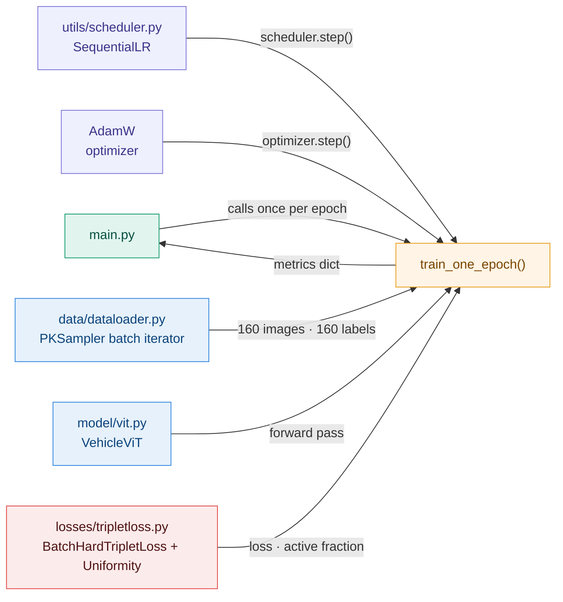
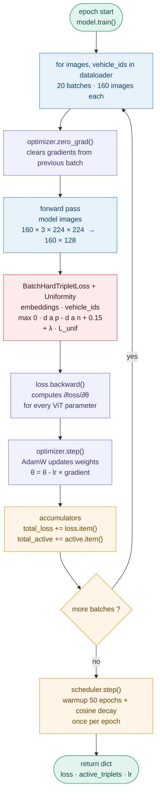

# Training — `engine/train.py`

## Overview

`train.py` implements one training epoch. `main.py` calls `train_one_epoch()`
in a loop over 2000 epochs and handles checkpointing, evaluation and logging.

---

## Architecture



---

## Batch loop — one epoch



---

## Key steps

### `model.train()`
Activates dropout — 10% of activations randomly zeroed at each forward pass.
Disabled automatically at `model.eval()` for deterministic kNN embeddings.

### `optimizer.zero_grad()`
PyTorch accumulates gradients by default. Without reset, gradients from batch
$t$ accumulate into batch $t+1$ — weights are updated with corrupted information.
Called **before** the forward pass, once per batch.

### Forward pass
```
(160, 3, 224, 224)  →  patch_embed  →  (160, 196, 192)
                    →  CLS + pos_embed + dropout
                    →  Transformer × 6
                    →  CLS + norm + proj_head + L2
                    →  (160, 128)   L2-normalized embeddings
```

### `BatchHardTripletLoss`
Receives `embeddings (160, 128)` and `vehicle_ids (160,)`.
Mines hardest positive and hardest negative per anchor within the batch.
Returns `loss` (scalar, can be negative due to uniformity term) and
`active` (fraction of non-zero triplets).
`loss.backward()` propagates gradients through the full ViT graph.

Combined loss:
$$\mathcal{L}_{\text{total}} = \mathcal{L}_{\text{triplet}} + \lambda_{\text{unif}} \cdot \mathcal{L}_{\text{unif}}, \quad \lambda = 0.05$$

### `optimizer.step()`
AdamW reads the gradients and updates all ViT weights:
$$\theta_{t+1} = \theta_t - \frac{\gamma}{\sqrt{v_t}+\epsilon}m_t - \gamma\lambda\theta_t$$
Uses the lr currently set by the scheduler.

### `scheduler.step()`
Called **once per epoch**, after all batches — not inside the batch loop.
20 batches per epoch — calling inside the loop would decay the lr 20× too fast.
Linear warmup over 50 epochs, then cosine decay to epoch 2000.

---

## Connections

| Module | Role |
|---|---|
| `data/dataloader.py` | PKSampler batch iterator — 20 batches × 160 images |
| `model/vit.py` | Forward pass — images to L2-normalized embeddings |
| `losses/tripletloss.py` | Batch-hard triplet loss + uniformity — loss + active fraction |
| `utils/scheduler.py` | Built in `main.py`, stepped once per epoch |
| `engine/evaluate.py` | Called by `main.py` every 10 epochs |
| `monitoring/` | Logger, triplet health, gradient health |
