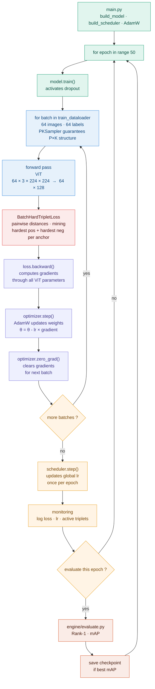

# Training — `engine/train.py`

## Overview

`train.py` orchestrates the full training loop. It connects every component
built so far — data, model, loss, optimizer and scheduler — into a single
coherent pipeline that minimizes the triplet loss over 50 epochs.

`main.py` calls `train_one_epoch()` once per epoch and handles checkpointing,
evaluation scheduling and logging at the top level.

---

## Full training flow



---

## Key steps explained

### `model.train()`

Switches the model to training mode. Two things change:
- **Dropout is active** — 10% of activations are randomly zeroed
- **BatchNorm** uses batch statistics (not used here but standard practice)

At `model.eval()` during evaluation, dropout is disabled — embeddings are
deterministic and reproducible for kNN retrieval.

### Forward pass

The full ViT pipeline produces one L2-normalized embedding per image:

```
(64, 3, 224, 224)   batch of images
      ↓ patch_embed
(64, 196, 192)      patch tokens
      ↓ CLS + pos_embed + dropout
(64, 197, 192)
      ↓ transformer × 6
(64, 197, 192)
      ↓ CLS extraction + norm + proj_head + L2
(64, 128)           embeddings ready for triplet loss
```

### BatchHardTripletLoss

Receives `(embeddings, labels)` — computes the pairwise distance matrix,
mines the hardest positive and hardest negative per anchor, returns the
mean loss over the batch. A scalar — `loss.backward()` propagates gradients
through the full computation graph back to every ViT parameter.

### `optimizer.zero_grad()`

PyTorch **accumulates** gradients by default — each `.backward()` call adds
to existing gradients. `zero_grad()` resets them to zero before each batch
so gradients from batch $t$ do not contaminate batch $t+1$.

### `scheduler.step()`

Called **once per epoch**, after all batches — not after each batch.
Updates the global learning rate according to the warmup + cosine schedule.
Calling it inside the batch loop would make the lr decay 27× too fast
(27 batches per epoch).

### Checkpoint saving

The model is saved when it achieves a new best mAP on the validation set.
The checkpoint stores both the model weights and the optimizer state —
the optimizer state contains the AdamW gradient history per parameter,
which allows training to resume without losing momentum.

---

## What `train.py` exposes

```
train_one_epoch(model, dataloader, loss_fn, optimizer, device)
    → dict : {loss: float, active_triplets: float, lr: float}
```

`main.py` calls `train_one_epoch()` in the epoch loop and handles
checkpointing, evaluation frequency and early stopping at the top level.
This separation keeps `train.py` focused on a single epoch and `main.py`
in control of the global training strategy.

---

## Connections to other modules

| Module | Role in training |
|---|---|
| `data/dataloader.py` | Provides the PKSampler-structured batch iterator |
| `model/vit.py` | Forward pass — images to embeddings |
| `losses/triplet.py` | Computes batch-hard triplet loss |
| `utils/scheduler.py` | Built once in `main.py`, stepped once per epoch |
| `engine/evaluate.py` | Called every N epochs to compute Rank-1 and mAP |
| `monitoring/logger.py` | Receives loss, lr, active triplet fraction per epoch |
| `monitoring/triplet_health.py` | Tracks active triplet fraction over training |
| `monitoring/gradient_health.py` | Detects vanishing or exploding gradients |
